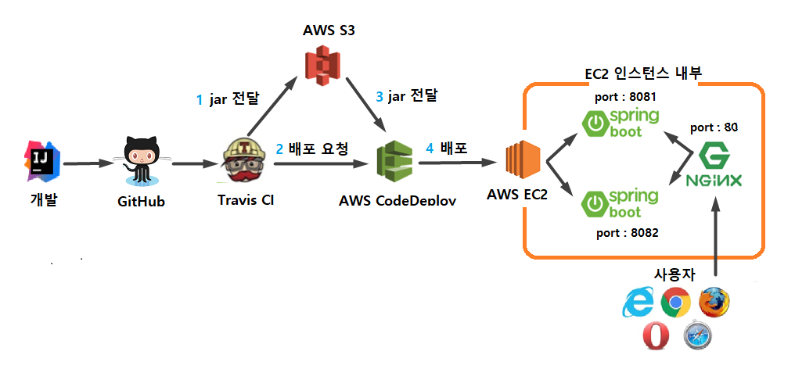

# 코드가 푸시되면 자동으로 배포

- 24시간 365일 운영되는 서비스에서 배포 환경 구축은 필수 과제 중 하나
- 우리 개발자의 코드가 실시간으로 병합되고, 테스트가 수행되는 환경, master 브랜치가 푸시되면 배포가 자동으로 이루어지는 환경을 구축하지 않으면 실수할 여지가 너무 많다.

# CI & CD 란

- `CI(Continuous Integration - 지속적 통합)` 은 코드 버전 관리를 하는 VCS 시스템(Git, SVN 등)에 PUSH가 되면 자동으로 테스트와 빌드가 수행되어 안정적인 배포 파일을 만드는 과정
- `CD(Continuous Deployment - 지속적인 배포)` 은 위의 빌드 결과를 자동으로 운영 서버에 무중단 배포까지 진행하는 과정
- 일반적으로 CI만 독립적으로 구축되어 있지는 않고 CD는 함께 구축된 경우가 많다.
- CI와 CD의 배경

  - 협업하는 웹 개발 과정에서 매주 코드 병합일을 정하여 코드를 합치는 일을 했었는데, 이 수작업은 효율이 좋지 않았다.
  - 그래서 개발자들은 지속해서 코드가 통합되는 환경(CI)을 구축하게 되었고, 개발자 각자가 원격 저장소(ex. 깃허브) 로 푸시가 될 때마다 코드를 병합하고, 테스트 코드와 빌드를 수행하면서 자동으로 코드가 병합되어 더는 수동으로 코드를 통합할 필요가 없어지면서 개발에만 집중 가능
  - CD 역시 마찬가지. 한두 대의 서버에 개발자가 수동으로 배포를 할 수 있지만, 수백 대의 서버에 배포하거나 긴박하게 배포를 해야 하는 상황에서는 더는 수동으로 배포를 할 수 없는 상황. 그래서 `자동화`. 이 덕에 개발에만 집중 가능
  - `주의할 점`은 단순히 CI 도구를 도입했다고 해서 CI를 하고 있는 것이 아니다라는 것. CI에 대해 4가지 규칙이 중요

    1. 모든 소스 코드가 살아 있고(현재 실행되고), 누구든 현재의 소스에 접근할 수 있는 단일지점을 유지할 것
    2. 빌드 프로세스를 자동화해서 누구든 소스로부터 시스템을 빌드하는 단일 명령어를 사용할 수 있게 할 것
    3. `테스팅을 자동화`해서 단일 명령어로 언제든지 시스템에 대한 건전한 테스트 수트를 실행할 수 있게 한 것
    4. 누구나 현재 실행 파일을 얻으면 지금까지 가장 완전한 실행 파일을 얻었다는 확신을 할 것

    - 4가지 중에서 `테스팅 자동화`가 가장 주요. 지속통합을 위해서는 이 프로젝트가 완전한 상태임을 보장하기 위해 테스트 코드가 구현되어 있어야만 하기 때문이다.

# Travis CI 연동하기

- Travis CI는 깃허브에서 제공하는 무료 CI 서비스이다. 젠킨스와 같은 CI 도구도 있으나, 젠킨스는 설치형이므로 이를 위한 EC2 인스턴스가 하나 더 필요하다. 오픈소스 웹 서비스인 Travis CI를 사용

- Travis CI 웹 서비스 설정

  - [링크](https://travis-ci.org/) 에서 깃허브 계정으로 로그인 한 뒤, 우측 상단에 `계정명`-`Settings` 클릭
  - 설정 페이지 아래쪽 보면 깃허브 저장소 검색창이 있다.
  - 저장소 이름 입력해서 찾은 후 오른쪽의 상태바 활성화
  - 활성화된 저장소 클릭하면 저장소 빌드 히스토리 페이지로 이동
  - 추가적인 상세설정은 프로젝트의 yml파일로 진행해야 한다.

- 프로젝트 설정

  - Travis CI의 상세 설정은 프로젝트에 존재하는 `.travis.yml` 파일로 할 수 있다. cf) [YAML이란?](#YAML이란?)
  - Travis CI 설정 (프로젝트의 build.gradle과 같은 위치에서) `.travis.yml`생성

    ```
        language: java
    jdk:
      - openjdk8

    branches:
      only:
        - master

    # Travis CI 서버의 Home
    cache:
      directories:
        - '$HOME/.m2/repository'
        - '$HOME/.gradle'

    before_install:
      "chmod +x gradlew"

    script:
      "./gradlew clean build"

    # CI 실행 완료 시 메일로 알람
    notifications:
      email:
        recipients:
          - (메일)
    ```

    - `branchs`

      - Travis CI를 어느 브랜치가 푸시될 때 수행할지 지정한다
      - 현재 옵션은 오직 master 브랜치에 push될 때만 수행

    - `cache`

      - 그레이들을 통해 의존성을 받게 되면 이를 해당 디렉토리에 캐시하여, 같은 의존성은 다음 배포 때부터 다시 받지 않도록 설정

    - `script`

      - master 브랜치에 푸시되었을 때 수행하는 명령어
      - 여기서는 프로젝트 내부에 둔 gradlew을 통해 clean & build 를 수행

    - `notifications`

      - Travis CI 실행 완료 시 자동으로 알람이 가도록 설정

  - 여기까지 마친 뒤, master브랜치에 커밋과 푸시하면, 좀 전의 Travis CI 저장소 페이지 확인하면 빌드 성공한 것을 확인 가능. 그 후 `.travis.yml`에 등록한 이메일 확인

# Travis CI와 AWS S3 연동하기



- S3(Simple Storage Service)란?
  - AWS에서 제공하는 일종의 `파일 서버` 이미지 파일을 비롯한 정적 파일들을 관리하거나 지금 진행하는 것처럼 배포 파일들을 관리하는 등의 기능 지원. 보통 이미지 업로드를 구현한다면 이 S3를 이용하여 구현하는 경우가 많다. ex) 게시글에 첨부파일 등록 구현할 때 많이 사용
- 첫 번째 단계로 Travis CI와 S3연동. 실제 배포는 `AWS CodeDeploy` 라는 서비스 이용. 하지만 S3 연동이 먼저 필요한 이유는 Jar 파일을 전달하기 위해서다. CodeDeploy는 저장 기능이 없다. 그래서 Travis CI가 빌드한 결과물을 받아서 CodeDeploy가 가져갈 수 있도록 보관할 수 있는 `공간`이 필요하다. 이럴 때 AWS S3를 이용한다. cf) [CodeDeploy가 빌드도 하고 배포도 할 수 있는데 왜 굳이 빌드와 배포를 분리하나](<#(빌드와-배포의-분리)>)

## AWS Key 발급

- 일반적으로 AWS 서비스에 외부 서비스가 접근할 수 없다. 그러므로 `접근 가능한 권한 가진 Key`를 생성해서 사용해야 한다. AWS에서는 이러한 인증과 관련된 기능을 제공하는 서비스로 `IAM(Identity and Access Management)`가 있다.
- IAM은 AWS에서 제공하는 서비스의 접근 방식과 권한을 관리한다. 이 IAM을 통해 Travis CI가 AWS의 S3와 CodeDeploy에 접근할 수 있도록 시도.
- AWS 웹 콘솔에서 `IAM` 검색하여 이동. IAM 왼쪽 사이드바에서 `사용자` -> `사용자 추가` 버튼을 차례로 클릭
- 생성할 사용자의 이름과 엑세스 유형 선택
  - 사용자 이름 `freelec-travis-deploy`
  - 엑세스 유형 `프로그래밍 방식 엑세스`
- 권한 설정 방식
  - `기존 정책 직접 연결` 선택
  - 화면 아래 정책 검색 화면에서 `s3full` 로 검색하여 체크하고 다음 권한으로 `CodeDeployFull`을 검색하여 체크
- 태그는 Name 값을 정하는데, 본인이 인지 가능한 정도의 이름으로 만들기
- 최종 생성 완료되며 `액세스 키`와 `비밀 엑세스 키`가 생성된다. 이 두 값이 Travis CI에서 사용될 키.

## Travis CI에 위의 키 등록

- TravisCI의 설정 화면으로 이동 `settings`
- 설정 화면 내리면 `Environment Variables` 항목이 있다.
  - AWS_ACCESS_KEY : 엑세스 키 ID
  - AWS_SECRET_KEY : 비밀 엑세스 키
  - 등록후 `Add`
- 여기에 등록된 값들은 이제 `.travis.yml`에서 `$AWS_ACCESS_KEY`, `AWS_SECRET_KEY` 란 이름으로 사용할 수 있다
- 이 키들을 사용해서 Jar를 관리할 S3 버킷을 생성하겠다

## S3 버킷 생성

- S3에 관해 설정 진행
- S3는 파일 서버의 역할이므로 Travis CI에서 생성된 Build 파일을 저장하도록 구성. S3에 저장된 Build 파일은 이후 AWS의 CodeDeploy에서 배포할 파일로 가져가도록 구성할 예정
- AWS 서비스에서 `S3`를 검색 후 이동. `버킷 만들기` 클릭
- 원하는 `버킷명` 생성. 이 버킷에 배포할 Zip파일이 모여있는 장소임을 의미하도록 짓는 것 추천. 여기서는 `freelec-springboot-build-june`
- `버전관리` 는 그냥 넘어감
- 버킷의 `보안과 권한 설정`. 퍼블릭 엑세스를 여는 경우가 있는데 `모든 차단(모든 퍼블릭 엑세스 차단` 해야 한다. 현재 프로젝트는 이미 깃허브에 오픈소스로 풀렸으니 문제없지만, 실제 서비스에서 할 때는 Jar파일이 퍼블릭이면 누구나 내려받을 수 있어 코드나 설정값, 주요키 값들이 다 탈취될 수 있다.
- `퍼블릭이 아니더라도` 우리는 IAM 사용자로 발급받은 키를 사용하니 접근 가능.
- S3가 생성되었으니 이제 이 S3로 배포 파일을 전달

## .travis.yml 추가

- Travis CI에서 빌드하여 만든 Jar 파일을 S3에 올릴 수 있도록 .travis.yml 에 다음 코드 추가

  ```
  (...생략...)

  before_deploy:
    - zip -r freelec-springboot2-webservice *
    - mkdir -p deploy
    - mv freelec-springboot2-webservice.zip deploy/freelec-springboot2-webservice.zip

  deploy:
    - provider: s3
      access_key_id: $AWS_ACCESS_KEY # Travis repo settings에 설정된 값
      access_access_key: $AWS_SECRET_KEY # Travis repo settings에 설정된 값
      bucket: freelec-springboot-build-june # S3 버킷
      region: ap-northeast-2
      skip_cleanup: true
      acl: private # zip 파일 접근을 private으로
      local_dir: deploy # before_deploy에서 생성한 디렉토리
      wait-until-deployed: true
  ```

  - `before_deploy`
    - deploy명령어가 실행되기 전에 수행된다
    - CodeDeploy는 Jar 파일은 인식하지 못하므로 Jar + 기타 설정 파일들을 모아 압축(zip)한다
  - `zip -r freelec-springboot2-webserivce`
    - 현재 위치의 모든 파일을 freelec-springboot2-webservice 이름으로 압축(zip)한다
    - 명령어의 마지막 위치는 본인의 프로젝트 이름이어야 한다
  - `mkdir -p deploy`
    - deploy라는 디렉토리를 Travis CI가 실행중인 위치에서 생성
  - `mv freelec-springboot2-webservice.zip deploy/freelec-springboot2-webservice.zip`
    - freelec-springboot2-webservice.zip 파일을 deploy/freelec-springboot2-webservice.zip으로 이동
  - `deploy`
    - S3로 파일 업로드 혹은 CodeDeploy로 배포 등 외부 서비스와 연동될 행위들을 선언
  - `local_dir: deploy`
    - 앞에서 생성한 deploy 디렉토리를 지정
    - 해당 위치의 파일들만 S3로 전송

- 설정이 끝났다면 깃허브로 푸시. Travis CI에서 자동으로 빌드가 진행되는 것 확인하고, 모든 빌드가 성공하는지 확인. 다음과 같은 로그가 나온다면 Travis CI의 빌드가 성공한 것 (`current` 탭에서 마지막 부분에서 확인 가능)

  ```
  Installing deploy dependenceis
  Logging in with Access Key: ****************88
  Beginning ...
  ...(중략)...
  Done. Your build exited with 0.
  ```

- 그리고 S3 버킷을 가보면 업로드가 성공한 것을 확인할 수 있다.
- Travis CI를 통해 자동으로 파일이 올려진 것을 확인할 수 있다(나는 깃허브에 push만 했을 뿐인데)
- Travis CI와 S3 연동이 완료되었으니, 이제 CodeDeploy로 배포까지 완료해 보겠다.

# Travis CI와 AWS S3, CodeDeploy 연동하기

- AWs의 배포 시스템인 CodeDeploy를 이용하기 전에 배포 대상인 EC2가 CodeDeploy를 연동 받을 수 있게 IAM 역할을 하나 생성

## EC2에 IAM 역할 추가하기

- S3와 마찬가지로 IAM을 검색하고, 이번에는 `역할` 탭을 클릭해서 이동한다. `역할` -> `역할 만들기` 버튼을 차례로 클릭
- 참고로 이전의 단계에서 만들어떤 IAM의 `사용자`와 여기서 만드려고 하는 `역할`은 어떤 차이가 있을까?

  - 역할
    - `AWS 서비스에만` 할당할 수 있는 권한
    - EC2, CodeDeploy, SQS 등
  - 사용자
    - `AWS 서비스 외에` 사용할 수 있는 권한
    - 로컬PC, IDC 서버 등

- 지금 만들 권한은 EC2에서 사용할 것이므로 `역할`로 처리.
- 서비스 선택에서 `AWS 서비스` -> `EC2` 차례로 선택 -> `다음`

- 정책에서는 `EC2RoleForA` 를 검색하여 `AmazonEC2RoleforAWS-CodeDeploy`를 선택

- 태그는 본인이 원하는 이름으로 짓는다
  - Name
  - ec2-codedeploy-role
- 역할의 이름을 등록하고 나머지 등록 정보를 최종적으로 확인

  - 역할이름 : ec2-codedeploy-role

- 이렇게 만든 역할을 EC2 서비스에 등록. EC2 인스턴스 목록으로 이동한 뒤, 본인의 인스턴스를 마우스 우클릭으로 `인스턴스 설정`-> `IAM 역할 연결/바꾸기` 를 차례로 선택

- 방금 생성한 역할을 선택 `ec2-codedpeloy-role`

- 역할 선택이 완료되면 해당 EC2 인스턴스를 `재부팅`. 재부팅을 해야만 역할이 정상적으로 적용되니 꼭 한 번은 재부팅해야 한다.

- 재부팅이 완료되었으면 CodeDeploy의 요청을 받을 수 있게 에이전트를 하나 설치하겠다.

## CodeDeploy 에이전트 설치

- EC2에 접속해서(윈도우는 putty로) 다음 명령어 입력

```
aws s3 cp s3://aws-codedeploy-ap-northeast-2/latest/install . --region ap-northeast-2
```

- 내려받기가 성공했다면 다음과 같은 메시지가 콘솔에 출력된다

```
download: s3://aws-codedeploy-ap..(중략)..  ./install
```

- install 파일에 실행 권한이 없으니 실행 권한을 추가한다

```
chmod +x ./install
```

- install 파일로 설치를 진행한다

```
sudo ./install auto
```

- 설치가 끝났으면 Agent가 정상적으로 실행되고 있는지 상태 검사를 한다

```
sudo service codedeploy-agent status
```

- 다음과 같이 running메시지가 출력되면 정상

```
The AWS CodeDeploy agent is running as PID xxx
```

- (만약) ruby가 설치되지 않았다는 에러가 발생하면 설치

```
sudo yum install ruby
```

## CodeDeploy를 위한 권한 생성

- CodeDeploy 에서 EC2 에 접근하려면 마찬가지로 권한이 필요
- AWS의 서비스이니 IAM 역할을 생성. 서비스는 `IAM` - `역할` - `역할 만들기` - `AWS 서비스` -> `CodeDeploy`를 차례로 선택
- CodeDeploy는 권한이 하나뿐이라서 선택 없이 바로 다음으로 넘어가면 된다.
- 태그 역시 내가 원하는 이름으로 지으면 된다. `Name` / `CodeDeploy-role`
- CodeDeploy를 위한 역할 이름과 선택 항목들을 확인한 뒤 생성 완료를 한다.
  - 역할 이름 : `codedeploy-role`

## CodeDeploy는 AWS의 배포 삼형제 중 하나. 배포 3형제는 다음과 같다.

1. Code commit

   - 깃허브와 같은 코드 저장소의 역할.
   - 프라이빗 기능을 지원하다는 강점이 있지만, 현재 깃허브에서 무료로 프라이빗 지원을 하고 있어서 거의 사용되지 않는다.

2. Code Build

   - Travis CI와 마찬가지로 빌드용 서비스.
   - 멀티 모듈을 배포해야 하는 경우 사용해 볼만하지만 규모가 있는 서비스에서는 대부분 젠킨스/팀시티 등을 이용하니 이것 역시 사용할 일이 거의 없다.

3. CodeDeploy
   - AWS의 배포 서비스
   - 앞에서 언급한 다른 서비스들은 대체제가 있고, 딱히 대체재보다 나은 점이 없지만, CodeDeploy는 대체제가 없다.
   - 오토 스케일링 그룹 배포, 블루 그린 배포, 롤링 배포, EC2 단독 배포 등 많은 기능 지원

- 이 중에서 현재 진행 중인 프로젝트에서는 Code Commit의 역할은 `깃허브`가, Code Build의 역할은 `Travis CI`가 하고 있다. 그래서 추가로 사용할 서비스는 `CodeDeploy`이다.

- CodeDeploy서비스로 이동해서 화면 중앙에 있는 `애플리케이션 생성` 버튼 클릭.
- 생성할 CodeDeploy의 이름)`freelec-springboot-webserivce`과 컴퓨팅 플랫폼을 선택. 컴퓨팅 플랫폼에선 `EC2/온프레미스`를 선택.

- 생성이 완료되면 배포 그룹을 생성하라는 메시지를 볼 수 있다. 화면 중앙의 `배포 그룹 생성` 버튼 클릭
- 배포 그룹 이름(freelec-springboot2-webservice-group)과 서비스 역할을 등록. 서비스 역할은 직전에 생성한 CodeDeploy용 IAM 역할을 선택하면 된다.

- 배포 유형에서는 `현재 위치`를 선택. 만약 본인이 배포할 서비스가 2대 이상이라면 블루/그린을 선택하면 된다. 여기선 1대의 EC2에만 배포하므로 선택하지 않는다.

- 환경구성에서는 `Amazon EC2 인스턴스`에 체크. 키/값은 각각 `Name`, `freelec-springboot2-webservice`.
- 마지막으로 배포 구성을 선택 `CodeDeployDefaultAllAtOnce` 하고 로드 밸런스 `체크 해제`

  - `CodeDeployDefaultAllAtOnce` 는 한번에 다 배포하는 것을 의미한다. 배포 구성이란 한 번 배포할 때 몇 대의 서버에 배포할지를 결정. 2대 이상이라면 1대씩 배포할지, 30% 혹은 50%로 나눠서 배포할지 등등을 선택하는 것. 여기서는 1대 서버다 보니 전체 배포하는 옵션으로 체크

- 이제 Travis CI와 CodeDeploy를 연동

## Travis CI, S3, CodeDeploy 연동

- 먼저 S3에서 넘겨질 zip 파일을 저장할 디렉토리를 하나 생성. EC2 서버에 접속해서 다음과 같이 디렉토리를 생성

```
mkdir ~/app/step2 && mkdir ~/app/step2/zip
```

- Travis CI의 Build가 끝나면 S3에 zip 파일이 전송되고, 이 zip파일은 /home/ec2-user/app/step2/zip로 복사되어 압축을 풀 예정

- Travis CI의 설정은 .travis.yml로 진행했음
- AWS CodeDeploy의 설정은 `appspec.yml`로 진행한다. (.travis.yml과 같은 계층(위치)에서 생성하면 된다)
- `appspec.yml` 파일

  ```
  version: 0.0
  os: linux
  files:
    - source: /
      destination: /home/ec2-user/app/step2/zip/
      overwrite: yes
  ```

  - `version: 0.0`

    - CodeDeploy의 버전을 이야기한다
    - 프로젝트 버전이 아니므로 0.0 외에 다른 버전을 사용하면 에러가 발생한다

  - `source`

    - CodeDeploy에서 전달해 준 파일 중 desination으로 이동시킬 대상을 지정
    - 루트 경로(/)를 지정하면 전체 파일을 이야기한다

  - `destination`
    - source에서 지정된 파일을 받을 위치
    - 이후 Jar를 실행하는 등은 destination에서 옮긴 파일들로 진행된다
  - `overwrite`
    - 기존에 파일들이 있으면 덮어쓸지를 결정
    - yes라고 했으니 파일들을 덮어쓴다.

- .travis.yml에도 CodeDeploy 내용을 추가한다. deploy 항목에 다음 코드를 추가

```
deploy:
  ...

  - provider: codedeploy
    access_key_id: #AWS_ACCESS_KEY # Travis repo settings에 설정된 값
    secret_access_key: #AWS_ACCESS_KEY # Travis repo settings에 설정된 값
    bucket: freelec-springboot-build-june # S3 버킷
    key: freelec-springboot2-webservice.zip # 빌드 파일을 압축해서 전달
    bundle_type: zip #압축 확장자
    application: freelec-springboot2-webservice # 웹 콘솔에서 등록한 CodeDeploy 어플리케이션
    deployment_group: freelec-springboot2-webservice-group # 웹 콘솔에서 등록한 CodeDeploy 배포 그룹
    region: ap-northeast-2
    wait-until-deployed: true

```

- 위는 S3옵션과 유사하다. 다른 부분은 CodeDeploy의 애플리케이션 이름과 배포 그룹명을 지정하는 것이다.
  .travis.yml의 전체 코드는 다음과 같다.

```
language: java
jdk:
  - openjdk8

branches:
  only:
    - master

# Travis CI 서버의 Home
cache:
  directories:
    - '$HOME/.m2/repository'
    - '$HOME/.gradle'

before_install:
  "chmod +x gradlew"

script:
  "./gradlew clean build"


before_deploy:
  - zip -r freelec-springboot2-webservice *
  - mkdir -p deploy
  - mv freelec-springboot2-webservice.zip deploy/freelec-springboot2-webservice.zip


deploy:
  - provider: s3
    access_key_id: #AWS_ACCESS_KEY # Travis repo settings에 설정된 값
    secret_access_key: #AWS_ACCESS_KEY # Travis repo settings에 설정된 값
    bucket: freelec-springboot-build-june # S3 버킷
    region: ap-northeast-2
    skip_cleanup: true
    acl: private # zip 파일 접근을 private으로
    local_dir: deploy # before_deploy에서 생성한 디렉토리
    wait-until-deployed: true

  - provider: codedeploy
    access_key_id: #AWS_ACCESS_KEY # Travis repo settings에 설정된 값
    secret_access_key: #AWS_ACCESS_KEY # Travis repo settings에 설정된 값
    bucket: freelec-springboot-build-june # S3 버킷
    key: freelec-springboot2-webservice.zip # 빌드 파일을 압축해서 전달
    bundle_type: zip #압축 확장자
    application: freelec-springboot2-webservice # 웹 콘솔에서 등록한 CodeDeploy 어플리케이션
    deployment_group: freelec-springboot2-webservice-group # 웹 콘솔에서 등록한 CodeDeploy 배포 그룹
    region: ap-northeast-2
    wait-until-deployed: true

# CI 실행 완료 시 메일로 알람
notifications:
  email:
    recipients:
      - (메일주소)
```

- 모든 내용을 작성했다면 프로젝트를 `커밋하고 푸시`한다. 깃허브로 푸시가 되면 Travis CI가 자동으로 시작된다. (travis-ci.org에서 확인가능). Travis CI가 끝나면 CodeDeploy 화면 아래에서 배포가 수행되는 것을 확인할 수 있다. (로그로 성공 확인하기)

- 배포가 끝났다면 다음 명령어로 파일들이 잘 도착했는지 확인해 보기

```
cd /home/ec2-user/app/step2/zip
```

- 파일 목록 확인하기

```
ll
```

- 그러면 프로젝트 파일들이 잘 도착한 것을 확인할 수 있다

  - README.md
  - appspec.yml
  - build 등

- 이렇게 Travis CI와 S3, CodeDeploy가 연동이 완료되었다.

# 배포 자동화 구성

- 앞의 과정에서 Travis CI, S3, CodeDeploy 연동까지 구현되었다. 이제 이것을 기반으로 실제로 Jar를 배포하여 실행까지 해보겠습니다.

## dpeloy.sh 파일 추가

- 먼저 Step 환경에서 실행될 deploy.sh 를 생성. scripts 디렉토리를 생성(프로젝트 바로 밑 depth에)하여 여기에 스트립크를 생성

```
#!/bin/bash

REPOSITORY=/home/ec2-user/app/step2
PROJECT_NAME=freelec-springboot2-webservice

echo "> Build 파일 복사"

cp $REPOSITORY/zip/*.jar $REPOSITORY/

echo "> 현재 구동중인 애플리케이션 pid 확인"

CURRENT_PID=$(pgrep -fl freelec-springboot2-webservice | grep jar | awk '{print $1}')

echo "현재 구동중인 어플리케이션 pid: $CURRENT_PID"

if [ -z "$CURRENT_PID" ]; then
    echo "> 현재 구동중인 애플리케이션이 없으므로 종료하지 않습니다."
else
    echo "> kill -15 $CURRENT_PID"
    kill -15 $CURRENT_PID
    sleep 5
fi

echo "> 새 어플리케이션 배포"

JAR_NAME=$(ls -tr $REPOSITORY/*.jar | tail -n 1)

echo "> JAR Name: $JAR_NAME"

echo "> $JAR_NAME 에 실행권한 추가"

chmod +x $JAR_NAME

echo "> $JAR_NAME 실행"

nohup java -jar \
    -Dspring.config.location=classpath:/application.properties,classpath:/application-real.properties,/home/ec2-user/app/application-oauth.properties,/home/ec2-user/app/application-real-db.properties \
    -Dspring.profiles.active=real \
    $JAR_NAME > $REPOSITORY/nohup.out 2>&1 &
```

- `CURRENT_PID`
  - 현재 수행중인 스프링 부트 애플리케이션의 프로세스 ID를 찾는다.
  - 실행 중이면 종료하기 위해서이다.
  - 스프링 부트 애플리케이션 이름(freelec-springboot2-webservice)으로 된 다른 프로그램들이 있을 수 있어 freelec-springboot2-webservice로 된 jar(pgrep -fl freelec-springboot2-webservice) 프로세스를 찾은 뒤 ID를 찾는다(| awk '{print \$1}').
- `chomod +x $JAR_NAME`
  - Jar 파일은 실행 권한이 없는 상태
  - nohup으로 실행할 수 있게 실행 권한을 부여한다
- `$JAR_NAME > $REPOSITORY/nohup.out 2>&1 &`
  - nohup 실행 시 CodeDeploy는 무한 대기한다
  - 이 이슈를 해결하기 위해 nohup.out 파일을 표준 입출력용으로 별도로 사용한다
  - 이렇게 하지 않으면 nohup.out 파일이 생기지 않고, CodeDeploy 로그에 표준 입출력이 출력된다
  - nohup이 끝나기 전까지 CodeDeploy도 끝나지 않으니 꼭 이렇게 해야만 한다
- step1에서 작성된 deploy.sh와 크게 다르지 않다. 웃너 git pull을 통해 직접 빌드했던 부분을 제거했다. 그리고 Jar를 실행하는 단계에서 몇 가지 코드가 추가되었다.

## travis.yml 파일 수정

- 현재는 프로젝트의 모든 파일을 zip파일로 만드는데, 실제로 필요한 파일들은 Jar, appspec.yml, 배포를 위한 스크립트들이다. 이 외 나머지는 배포에 필요하지 않으니 포함하지 않겠다. 그래서 .travis.yml 파일의 before_deploy를 수정한다.

  ```
  before_deploy:
  - mkdir -p before-deploy # zip에 포함시킬 파일들을 담을 디렉토리 생성
  - cp scripts/*.sh before-deploy/
  - cp appspec.yml before-deploy/
  - cp build/libs/*.jar before-deploy/
  - cd before-deploy && zip -r before-deploy * # before-deploy로 이동후 전체 압축
  - cd ../ && mkdir -p deploy # 상위 디렉토리로 이동후 deploy 디렉토리 생성
  - mv before-deploy/before-deploy.zip deploy/freelec-springboot2-webservice.zip # deploy로 zip파일 이동
  ```

  - `mkdir -p before-deploy`
    - Travis CI는 C3로 특정 파일만 업로드가 안된다.
    - 디렉토리 단위로만 업로드할 수 있기 때문에 deploy 디렉토리는 항상 생성
  - `cp scripts/*.sh before-deploy/`
    - before-deploy에는 zip 파일에 포함시킬 파일들을 저장
  - `cd before-deploy && zip -r before-deploy *`
    - zip -r 명령어를 통해 before-deploy 디렉토리 전체 파일을 압축한다.

- 이 외 나머지 코드는 수정할 것이 없다
- 마지막으로 CodeDeploy의 명령을 담당할 appspec.yml 파일을 수정한다.

## appspec.yml 파일 수정

- appspec.yml 파일에 다음 코드 추가한다. location, timeout, runas의 들여쓰기를 주의해야 한다. 들여쓰기가 잘못될 경우 배포가 실패한다.

  ```
  permissions:
    - object: /
      pattern: "*"
      owner: ec2-user
      group: ec2-user

  hooks:
    ApplicationStart:
      - location: deploy.sh
        timeout: 60
        runas: ec-user
  ```

  - `permissions`
    - CodeDeploy에서 EC2 서버로 넘겨준 파일들을 모두 ec-user 권한을 갖도록 한다.
  - `hooks`
    - CodeDeploy 배포 단계에서 실행할 명령어를 지정
    - ApplicationStart라는 단계에서 deploy.sh를 ec2-user 권한으로 실행하게 한다
    - timeout: 60으로 스크립트 실행 60초 이상 수행되면 실패가 된다(무한정 기다릴 수 없으니 제한 필요)

- 전체 코드는 다음과 같다.

  ```
  version: 0.0
  os: linux
  files:
    - source:  /
      destination: /home/ec2-user/app/step3/zip/
      overwrite: yes

  permissions:
    - object: /
      pattern: "**"
      owner: ec2-user
      group: ec2-user

  hooks:
    ApplicationStart:
      - location: start.sh # 엔진엑스와 연결되어 있지 않은 Port로 새 버전의 스프링 부트를 시작.
        timeout: 60
        runas: ec2-user
  ```

- 모든 설정이 완료되었으니 깃허브로 커밋과 푸시. Travis CI에서 다음과 같이 성공 메시지 확인하고 CodeDeploy에서도 배포가 성공한 것 확인

  ```
  Preparing deploy
  Deploying application
  $ mkdir -p before-deploy
  $ cp scripts/*.sh before-deploy/
  ...
  (중략)
  ...
  Deploying ...
  Done. Your build exited with 0.
  ```

- 웹 브라우저에서도 Ec2 도메인을 입력해서 확인해 보기
  `http://ec2-3-35-70-236.ap-northeast-2.compute.amazonaws.com:8080/`

- 마지막으로 실제 배포하듯이 진행해 보겠다.

## 실제 배포 과정 체험

- build.gradle에서 프로젝트 버전 변경
  - 원래는 `version '1.0-SNAPSHOT'`
  - 변경은 `VERSION '1.0.1-SNAPSHOT'`
- 간단하게나마 변경된 내용을 알 수 있게 src/main/resources/templates/index.mustache 내용에 다음과 같이 Ver.2 텍스트 추가

  ```
  (중략)
  <h1>스프링 부트로 시작하는 웹 서비스 Ver.2</h1>
  (중략)
  ```

- 그리고 깃허브로 커밋과 푸시. 그럼 당므과 같이 변경된 코드(`Ver.2`)가 배포된 것을 확인할 수 있다.

  - `http://ec2-3-35-70-236.ap-northeast-2.compute.amazonaws.com:8080/` 에서 확인

- 이렇게 신규 버전(수정해서 배포)이 정상적으로 잘 배포되었다.

# CodeDeploy 로그 확인

- CodeDeploy와 같이 AWS가 지원하는 서비스에서는 오류가 발생했을 때 로그 찾는 방법을 모르면 오류를 해결하기가 어렵다. 그래서 배포가 실패하면 어느 로그를 봐야 할지 간단하게 소개
- CodeDeploy에 관한 대부분 내용은 `/opt/codedeploy-agent/deployment-root`에 있다. 해당 디렉토리로 이동(cd /opt/codedeploy-agent/deployment-root)한 뒤 목록을 확인해보면(`ll`) 다음과 같은 내용을 확인할 수 있다.

  ```
  (권한, 날짜 생략) (숫자+영문자)-(숫자-영문자)
  (권한, 날짜 생략) deployment-instructions
  (권한, 날짜 생략) deployment-logs
  (권한, 날짜 생략) ongoing-deployment
  ```

  - `(숫자+영문자)-(숫자-영문자)`
    - 최상단의 영문과 대시(-)가 있는 디렉토리명은 CodeDeploy ID이다.
    - 사용자마다 고유한 ID가 생성되어 각자 다른 ID가 발급되니 본인의 서버에는 다른 코드로 되어있다.
    - 해당 디렉토리로 들어가 보면 배포한 단위별로 배포 파일들이 있다/
    - 본인의 배포 파일이 정상적으로 왔는지 확인해 볼 수 있다.
  - `/opt/codedeploy-agent/deployment-root/deployment-logs/codedeploy-agent-deployments.log`
    - CodeDeploy 로그 파일이다.
    - CodeDeploy로 이루어지는 배포 내용 중 표준 입/출력 내용은 모두 여기에 있다.
    - 작성한 echo 내용도 모두 표기

- 이렇게 테스트, 빌드, 배포까지 전부 자동화되었다.
- 이제는 작업이 끝난 내용을 Master 브랜치에 푸시만 하면 자동으로 EC2에 배포가 된다.
- 배포하는 동안에도 서비스는 계속 유지가 될까
- 이제 `서비스 중단 없는 배포` 방법을 소개. `무중단 배포`. 다음 장에서

# 참고

## YAML이란?

- `YMAM(야믈)`이란 쉽게 말해 `JSON`에서 괄호를 제거한 것이다. YAML 이념이 `기계에서 파싱하기 쉽게, 사람이 다루기 쉽게` 이다보니 익숙치 않은 독자라도 읽고 쓰기가 쉽다.

## 빌드와 배포의 분리

- CodeDeploy가 빌드도 하고 배포도 할 수 있다. CodeDeploy에서는 깃허브 코드를 가져오는 기능을 지원하기 때문이다. 하지만 이렇게 할 때 빌드 없이 배포만 필요할 때 대응하기 쉽지 않다.
- 빌드와 배포가 분리되어 있으면 예전에 빌드되어 만들어진 Jar를 재사용하면 되지만 CodeDeploy가 모든 것을 하게 될 땐 `항상 빌드를 하게 되니(안해도 되는 경우에도)`, 확장성이 많이 떨어진다. 그래서 웬만하면 빌드와 배포는 분리하는 것을 추천

참고 : 스프링 부트와 AWS로 혼자 구현하는 웹 서비스 - 이동욱
