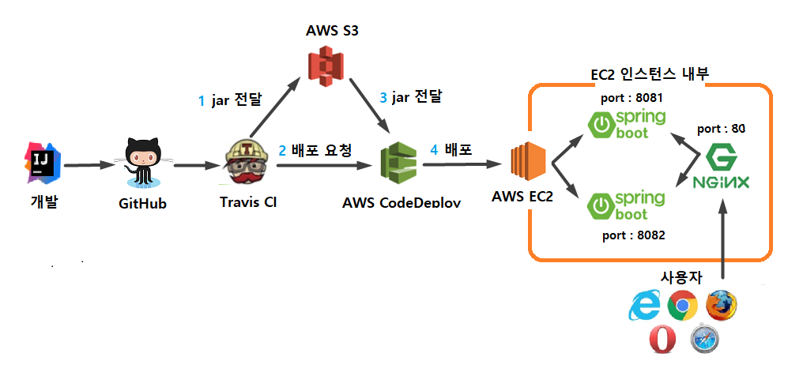

# 무중단 배포

- awsseries8까지 Travis CI를 활용하여 배포 자동화 환경을 구축했다. 하지만 배포하는 동안 애플리케이션이 종료된다는 문제가 남아있다. 긴 기간은 아니지만, 새로운 Jar가 실행되기 전까진 기존 Jar를 종료시켜 놓기 때문에 `서비스가 중단`된다. 반면 24시간 서비스하는 네이버나 카카오톡 같은 경우 배포하는 동안 서비스가 정지되지는 않는다.

## 무중단 배포란?

- 예전에는 배포가 엄청나게 큰 일이었기 때문에 개발자 모두가 고생했다. 심지어 배포 후 치명적인 문제가 발견되었을 때 서비스를 정지해야만 가능한 경우라면 롤백조차 어려우므로 개발자들이 정말 많이 비효율적으로 일했다. 서비스 입장에서도 배포만 했다 하면 서비스가 정지돼야 하니 곤란한 상황이 많았다. 그래서 서비스를 정지하지 않고, 배포할 수 있는 방법들을 찾기 시작했고 이를 `무중단 배포`라고 한다. 몇 가지 방법이 있다.

  1. AWS에서 블루 그린(Blue-Green)무중단 배포
  2. 도커를 이용한 웹서비스 무중단 배포

  이외에도 L4 스위치를 이용한 무중단 배포 방법도 있지만, L4가 워낙 고가의 장비이다 보니 대형 인터넷 기업 외에는 쓸 일이 거의 없다. 여기서는 `엔진엑스를 이용한 무중단 배포`이다. `엔진엑스`는 웹서버, 리버스, 프록시, 캐싱, 로드 밸런싱, 미디어 스트리밍 등을 위한 오픈소스 소프트웨어다. 이전에 아파치(Apache)가 대세였전 자리를 완전히 빼앗은 가장 유명한 웹서버이자 오픈소스이다. 고성능 웹서버이기 때문에 대부분 서비스들이 현재는 엔진엑스를 사용하고 있다. 엔진엑스가 가지고 있는 여러 기능 중 `리버스 프록시`가 있다. 리버스 프록시란 엔진엑스가 외부의 요청을 받아 백엔드 서버로 요청을 전달하는 행위를 얘기한다. 리버스 프록시 서버(엔진엑스)는 요청을 전달하고, 실제 요청에 대한 처리는 뒷단의 웹 애플리케이션 서버들이 처리한다. 여기서는 이 리버스 프록시를 통해서 무중단 배포 환경을 구축할 예정. `엔진엑스를 이용한 무중단 배포를 하는 이유`는 간단하다. 가장 저렴하고 쉽기 때문.

  기존에 쓰던 EC2에 그대로 적용하면 되므로 배포를 위해 AWS EC2 인스턴스가 하나 더 필요하진 않다. 추가로 이 방식은 꼭 AWS와 같은 클라우드 인프라가 구축되어 있지 않아도 사용할 수 있는 범용적 방법. 즉, 개인 서버 혹은 사내 서버에서도 동일한 방식으로 구축할 수 있으므로 사용처가 많다.

  구조는 간단하다. 하나의 EC2 혹은 리눅스 서버에 엔진엑스 1대와 스프링 부트 Jar를 2대를 사용하는 것.

  - 엔진엑스는 80(http). 443(https) 포트를 할당한다.
  - 스프링 부트 1은 8081 포트로 실행한다.
  - 스프링 부트 2는 8082 포트로 실행한다.

  `엔진엑스 무중단 배포 1`의 운영 과정은 다음과 같다.

  1. 사용자는 서비스 주소로 접속한다. (80 혹은 443 포트).
  2. 엔진엑스는 사용자의 요청을 받아 현재 연결된 스프링 부트로 요청을 전달한다. (스프링 부트1 즉, 8081 포트로 요청을 전달한다고 가정)
  3. 스프링 부트2는 엔진엑스와 연결된 상태가 아니니 요청받지 못한다.

  1.1 버전으로 신규 배포가 필요하면, 엔진엑스와 연결되지 않은 스프링부트2(8082포트)로 배포한다.

  `엔진엑스 무중단 배포2`의 운영 과정은 다음과 같다.

  1. 배포하는 동안에도 서비스는 중단되지 않는다. (엔진엑스는 스프링 부트1을 바라보기 때문)
  2. 배포가 끝나고 정상적으로 스프링 부트2가 구동 중인지 확인한다.
  3. 스프링 부트2가 정상 구동 중이면 nginx reload 명령어를 통해 8081 대신에 8082를 바라보도록 한다.
  4. nginx reload는 0.1초 이내에 완료된다.

  `엔진엑스 무중단 배포3`의 운영 과정은 다음과 같다.

  1. 현재는 엔진엑스와 연결된 것이 스프링 부트2이다.
  2. 스프링 부트1의 배포가 끝났다면 엔진엑스가 스프링 부트1을 바라보도록 변경하고 nginx reload를 실행한다.
  3. 이후 요청부터는 엔진엑스가 스프링 부트1로 요청을 전달한다.

  이렇게 구성되면 전체 시스템 구조는 다음과 같다.
  
  기존 구조에서 EC2 내부의 구조만 변경된 것이다.

## 엔진엑스 설치와 스프링 부트 연동하기

- 엔진엑스 설치

  - EC2에 접속해서 다음 명령어로 엔진엑스 설치

    ```
    sudo yum install nginx
    ```

  - 설치가 완료되었으면 다음 명령어로 엔진엑스 실행

    ```
    sudo service nginx start
    ```

  - 엔진엑스가 잘 실행되었다면 다음과 같은 메시지를 확인 가능

    ```
    Starting nginx : [Ok]
    ```

  - 이제 외부에서 잘 노출되는지 확인

- 보안 그룹 추가

  - 먼저 엔진엑스의 포트번호를 보안 그룹에 추가한다. 엔진엑스의 포트번호는 기본적으로 `80`이다. 해당 포트 번호가 보안 그룹에 없으니 `EC` -> `보안 그룹` -> `EC2 보안 그룹 선택` -> `인바운드 편집` 으로 차레로 이동해서 변경한다.

- 리다이렉션 주소 추가

  - 8080이 아닌 80포트로 주소가 변경되니 구글과 네이버 로그인에도 변경된 주소를 등록해야만 한다. 기존에 등록된 리디렉션 주소에서 8080 부분을 제거하여 추가 등록한다. 구글과 네이버에 차례로 등록한다. 앞서 등록한 주소에서 8080을 뺀 것으로 등록하면 된다.
  - 추가한 후에는 EC2의 도메인으로 접근하되, `8080포트를 제거하고` 접근해본다. 즉, 포트번호 없이 도메인만 입력해서 브라우저에서 접속해본다. 그럼 `엔진엑스 웹페이지`를 볼 수 있다.

  - 이제 스프링 부트와 연동해보겠다.

- 엔진엑스와 스프링 부트 연동

  - 엔진엑스가 현재 실행 중인 스프링 부트 프로젝트를 바라볼 수 있도록 프록시 설정을 하겠다. 엔진엑스 설정 파일을 열어보자.

  ```
  sudo vim /etc/nginx/nginx.conf
  ```

  - 설정 내용 중 server 아래의 location /부분을 찾아서 다음과 같이 추가한다.

    ```
    location / {
          proxy_pass http://localhost:8080;
          proxy_set_header X-Real-IP $remote_addr;
          proxy_set_header X-Forwarded-For $proxy_add_x_forwarded_for;
          proxy_set_header Host $http_host;
    }
    ```

    - `proxy_pass http://localhost:8080;`
      - 엔진엑스로 요청이 오면 http://localhost:8080로 전달
    - `proxy_set_header XXX`
      - 실제 요청 데이터를 header의 각 항목에 할당한다
      - ex) proxy_set_header X-Real-IP \$remote_addr:Request Header의 X-Real-IP에 요청자의 IP를 저장한다

  - 수정이 끝났으면 `:wq` 명령어로 저장하고 종료해서, 엔진엑스를 재작.

    ```
    sudo service nginx restart
    ```

  - 다시 브라우저로 접속해서 엔진엑스 시작 페이지가 보이면 화면을 새로고침 한다
  - 그러면 엔진엑스가 스프링 부트 프로젝트를 `프록시`하는 것이 확인된다. 본격적으로 무중단 배포 작업을 진행하겠다.

## 무중단 배포 스크립트 만들기

- 무중단 배포 스크립트 작업 전에 API를 하나 추가하겠다. 이 API는 이후 배포 시에 8081을 쓸지, 8082를 쓸지 판단하는 기준이 된다.

- profile API 추가

  - ProfileController를 만들어 다음과 같이 간단한 API 코드 추가

  ```

  @RequiredArgsConstructor
  @RestController
  public class ProfileController {
      private final Environment env;

      @GetMapping("/profile")
      public String profile() {
          List<String> profiles = Arrays.asList(env.getActiveProfiles());
          List<String> realProfiles = Arrays.asList("real", "real1", "real2");
          String defaultProfile = profiles.isEmpty()? "default" : profiles.get(0);

          return profiles.stream()
                  .filter(realProfiles::contains)
                  .findAny()
                  .orElse(defaultProfile);
      }
  }

  ```

  - `env.getActiveProfiles()`
    - 현재 실행중인 ActiveProfile을 모두 가져온다.
    - 즉, real, oauth, real-db 등이 활성화되어 있다면(active) 3개가 모두 담겨 있다.
    - 여기서 real, real1, real2는 모두 배포에 사용될 profile이라 이 중 하나라도 있으면 그 값을 반환하도록 한다
    - 실제로 이번 무중단 배포에서는 real1과 real2만 사용되지만, step2를 다시 사용해볼 수도 있으니 real도 남겨준다

- 추가한 코드가 잘 작성되는지 테스트 코드 작성. 해당 컨트롤러는 특별히 `스프링 환경이 필요하지는 않다`. 그래서 `@SpringBootTest`없이 테스트 코드를 작성한다

  ```
        @Test
        public void real_profile이_조회된다() {
            //given
            String expectedProfile = "real";
            MockEnvironment env = new MockEnvironment();
            env.addActiveProfile(expectedProfile);
            env.addActiveProfile("oauth");
            env.addActiveProfile("real-db");

            ProfileController controller = new ProfileController(env);

            //when
            String profile = controller.profile();

            //then
            assertThat(profile).isEqualTo(expectedProfile);
        }

        @Test
        public void real_profile이_없으면_첫번째가_조회된다() {
            //given
            String expectedProfile = "oauth";
            MockEnvironment env = new MockEnvironment();

            env.addActiveProfile(expectedProfile);
            env.addActiveProfile("real-db");

            ProfileController controller = new ProfileController(env);

            //when
            String profile = controller.profile();

            //then
            assertThat(profile).isEqualTo(expectedProfile);
        }

        @Test
        public void active_profile이_없으면_default가_조회된다() {
            //given
            String expectedProfile = "default";
            MockEnvironment env = new MockEnvironment();
            ProfileController controller = new ProfileController(env);

            //when
            String profile = controller.profile();

            //then
            assertThat(profile).isEqualTo(expectedProfile);
        }
    }
  ```

  - ProfileController나 Environment 모두 `자바 클래스(인터페이스)`이기 때문에 쉽게 테스트 가능. Environment는 인터페이스라 가짜 구현체인 MockEnvironment(스프링에서 제공) 를 사용해서 테스트하면 된다.
  - 이렇게 해보면 생성자 DI가 얼마나 유용한지 알 수 있다. `만약 Environment를 @Autowired로 DI 받았다면 이런 테스트 코드를 작성하지 못했을 것이다.` 항상 스프링 테스트를 해야만 했을 것. 앞의 테스트가 성공적으로 다 통과했다면 컨트롤러 로직에 대한 이슈는 없다는 것을 의미한다.

- 그리고 위의 /profile이 `인증 없이도 호출될 수 있게` `SecurityConfig 클래스`에 제외 코드를 추가한다.

  ```
  .antMatchers("/", "/css/**". "/images/**", "/js/**", "/h2-console/**", "/profile").permitAll()
  ```

  - permitAll 마지막에 "/profile"이 추가된다.

- 그리고 SecurityConfig 설정이 잘 되었는지도 테스트 코드로 검증한다. 이 검증은 스프링 시큐리티 설정을 불러와야 하니 @SpringBootTest를 사용하는 테스트 클래스`ProfileControllerTest`를 하나 더 추가한다.

  ```
  @RunWith(SpringRunner.class)
  @SpringBootTest(webEnvironment = SpringBootTest.WebEnvironment.RANDOM_PORT)
  public class ProfileControllerTest {

      @LocalServerPort
      private int port;

      @Autowired
      private TestRestTemplate restTemplate;

      @Test
      public void profile은_인증없이_호출된다() throws Exception {
          String expected = "default";

          ResponseEntity<String> response = restTemplate.getForEntity("/profile", String.class);
          assertThat(response.getStatusCode()).isEqualTo(HttpStatus.OK);
          assertThat(response.getBody()).isEqualTo(expected);
      }
  }
  ```

- 여기까지 모든 테스트가 성공했다면 깃허브로 푸시하여 배포한다. 배포가 끝나면 브라우저에서 /profile로 접속해서 `profile`이 잘 나오는지 확인한다.
  `http://ec2-3-35-70-236.ap-northeast-2.compute.amazonaws.com/profile` 로 접속

* real1, real2 profile 생성
  현재 EC2 환경에서 실행되는 profile은 real밖에 없다. 해당 profile은 `Travis CI 배포 자동화를 위한 profile` 이니 `무중단 배포`를 위한 profile 2개(real1, real2)를 src/main/resources 아래에 추가한다.

  - application-real1.properties

  ```
  server.port=8081
  spring.profiles.include=oauth,real-db
  spring.jpa.properties.hibernate.dialect=org.hibernate.dialect.MySQL5InnoDBDialect
  spring.session.store-type=jdbc
  ```

  - application-real2.properties

  ```
  server.port=8082
  spring.profiles.include=oauth,real-db
  spring.jpa.properties.hibernate.dialect=org.hibernate.dialect.MySQL5InnoDBDialect
  spring.session.store-type=jdbc
  ```

  - 위 2개의 profile은 real profile과 크게 다른 점은 없지만, 한 가지가 다르다. server.port가 8080이 아닌 8081/8082로 되어 있다. 이 부분만 주의해서 생성하고 생성한 후에는 깃허브로 푸시하면서 마무리한다.

- 엔진엑스 설정 수정

  - 무중단 배포의 핵심은 `엔진엑스 설정`이다. 배포 때마다 엔진엑스의 프록시 설정(스프링 부트로 요청을 흘려보내는) 이 순식간에 교체된다. 여기서 프록시 설정이 교체될 수 있도록 설정을 추가한다.
  - 엔진엑스 설정이 모여있는 /etc/nginx/conf.d/에 `service.url.inc`라는 파일을 하나 생성한다.

  ```
  sudo vim /etc/nginx/conf.d/service-url.inc
  ```

  그리고 다음 코드를 입력한다

  ```
  set $service_url http://127.0.0.1:8080;
  ```

  저장하고 종료한 뒤(:wq) 해당 파일은 엔진엑스가 사용할 수 있게 설정한다. 다음과 같이 nginx.conf파일을 열어보겠다.

  ```
  sudo vim /etc/nginx/nginx.conf
  ```

  location / 부분을 찾아서 다음과 같이 변경한다.

  ```
  include /etc/nginx/conf.d/service-url.inc;

  location / {
      proxy_pass $service_url;
      proxy_set_header X-Real-IP $remote_addr;
      proxy_set_header X-Forwarded-For $proxy_add_x_forwarded_for;
      proxy_set_header Host $http_host;
  }
  ```

  저장하고 종료한 뒤(:wq) 재시작한다.

  ```
  sudo service nginx restart
  ```

  다시 브라우저에서 정상적으로 호출되는지 확인. 확인되었다면 엔진엑스 설정까지 잘 된 것이다.
  `http://ec2-3-35-70-236.ap-northeast-2.compute.amazonaws.com/profile` 로 접속

* 배포 스크립트들 작성

  - 먼저 step2와 중복되지 않기 위해 EC2에 step3 디렉토리를 생성한다

  ```
  mkdir ~/app/step3 && mkdir ~/app/step3/zip
  ```

  - 무중단 배포는 앞으로 step3를 사용하겠다. 그래서 appspec.yml 역시 step3로 배포되도록 수정한다.

  ```
  version: 0.0
  os: linux
  files:
    - source:  /
      destination: /home/ec2-user/app/step3/zip/
      overwrite: yes
  ```

  - 무중단 배포를 진행할 스크립트들은 총 5개

    - stop.sh : 기존 엔진엑스에 연결되어 있진 않지만, 실행 중이던 스프링 부트 종료
    - start.sh : 배포할 신규 버전 스프링 부트 프로젝트를 stop.sh로 종료한 'profile'로 진행
    - health.sh : 'start.sh'로 실행시킨 프로젝트가 정상적으로 실행됐는지 체크
    - switch.sh : 엔진엑스가 바라보는 스프링 부트를 최신 버전으로 변경
    - profile.sh : 앞선 4개 스크립트 파일에서 공용으로 사용할 'profile'과 포트 체크 로직

  - appspec.yml에 앞선 스크립트를 사용하도록 설정한다

    ```
    hooks:
      AfterInstall:
        - location: stop.sh # 엔진엑스와 연결되어 있지 않은 스프링 부트를 종료.
          timeout: 60
          runas: ec2-user
      ApplicationStart:
        - location: start.sh # 엔진엑스와 연결되어 있지 않은 Port로 새 버전의 스프링 부트를 시작.
          timeout: 60
          runas: ec2-user
      ValidateService:
        - location: health.sh # 새 스프링 부트가 정상적으로 실행됐는지 확인.
          timeout: 60
          runas: ec2-user
    ```

    - Jar파일이 복사된 이후부터 차례로 앞선 스크립트들이 실행된다고 보면 된다. 각 스크립트들은 scrips 디렉토리에 추가하면 된다.

  - profile.sh

  ```
      #!/usr/bin/env bash

    # bash는 return value가 안되니 *제일 마지막줄에 echo로 해서 결과 출력*후, 클라이언트에서 값을 사용한다

    # 쉬고 있는 profile 찾기: real1이 사용중이면 real2가 쉬고 있고, 반대면 real1이 쉬고 있음
    function find_idle_profile()
    {
        RESPONSE_CODE=$(curl -s -o /dev/null -w "%{http_code}" http://localhost/profile)

        if [ ${RESPONSE_CODE} -ge 400 ] # 400 보다 크면 (즉, 40x/50x 에러 모두 포함)
        then
            CURRENT_PROFILE=real2
        else
            CURRENT_PROFILE=$(curl -s http://localhost/profile)
        fi

        if [ ${CURRENT_PROFILE} == real1 ]
        then
          IDLE_PROFILE=real2
        else
          IDLE_PROFILE=real1
        fi

        echo "${IDLE_PROFILE}"
    }

    # 쉬고 있는 profile의 port 찾기
    function find_idle_port()
    {
        IDLE_PROFILE=$(find_idle_profile)

        if [ ${IDLE_PROFILE} == real1 ]
        then
          echo "8081"
        else
          echo "8082"
        fi
    }

  ```

  - `$(curl -s -o /dev/null -w "%{http_code}" http://localhost/profile)`
    - 현재 엔진엑스가 바라보고 있는 스프링 부트가 정상적으로 수행 중인지 확인한다
    - 응답값을 HttpStatus로 받는다
    - 정상이면 200, 오류가 발생한다면 400~503 사이로 발생하니 400 이상은 모두 예외로 보고 real2를 현재 profile로 사용한다
  - `IDLE_PROFILE`
    - 엔진엑스와 연결되지 않은 profile입니다.
    - 스프링 부트 프로젝트를 이 profile로 연결하기 위해 반환한다
  - 'echo "\${IDLE_PROFILE}"
    - bash라는 스크립트는 값을 반환하는 기능이 없다
    - 그래서 제일 마지막 줄에 echo로 결과를 출력 후, 클라이언트에서 그 값을 잡아서 (\$(find_idle_profile)) 사용한다
    - 중간에 echo를 사용해서는 안 된다
  - stop.sh

  ```
  #!/usr/bin/env bash

  ABSPATH=$(readlink -f $0)
  ABSDIR=$(dirname $ABSPATH)
  source ${ABSDIR}/profile.sh

  IDLE_PORT=$(find_idle_port)

  echo "> $IDLE_PORT 에서 구동중인 애플리케이션 pid 확인"
  IDLE_PID=$(lsof -ti tcp:${IDLE_PORT})

  if [ -z ${IDLE_PID} ]
  then
    echo "> 현재 구동중인 애플리케이션이 없으므로 종료하지 않습니다."
  else
    echo "> kill -15 $IDLE_PID"
    kill -15 ${IDLE_PID}
    sleep 5
  fi
  ```

  - `ABSDIR=$(dirname $ABSPATH)`
    - 현재 stop.sh가 속해 있는 경로를 찾는다
    - 하단의 코드와 같이 profile.sh의 경로를 찾기 위해 사용
  - `source ${ABSDIR}/profile.sh`

    - 자바로 보면 일종의 import 구문
    - 해당 코드로 인해 stop.sh에서도 profile.sh의 여러 function을 사용할 수 있게 된다.

  - start.sh

  ```
  #!/usr/bin/env bash

  ABSPATH=$(readlink -f $0)
  ABSDIR=$(dirname $ABSPATH)
  source ${ABSDIR}/profile.sh

  REPOSITORY=/home/ec2-user/app/step3
  PROJECT_NAME=freelec-springboot2-webservice

  echo "> Build 파일 복사"
  echo "> cp $REPOSITORY/zip/*.jar $REPOSITORY/"

  cp $REPOSITORY/zip/*.jar $REPOSITORY/

  echo "> 새 어플리케이션 배포"
  JAR_NAME=$(ls -tr $REPOSITORY/*.jar | tail -n 1)

  echo "> JAR Name: $JAR_NAME"

  echo "> $JAR_NAME 에 실행권한 추가"

  chmod +x $JAR_NAME

  echo "> $JAR_NAME 실행"

  IDLE_PROFILE=$(find_idle_profile)

  echo "> $JAR_NAME 를 profile=$IDLE_PROFILE 로 실행합니다."
  nohup java -jar \
      -Dspring.config.location=classpath:/application.properties,classpath:/application-$IDLE_PROFILE.properties,/home/ec2-user/app/application-oauth.properties,/home/ec2-user/app/application-real-db.properties \
      -Dspring.profiles.active=$IDLE_PROFILE \
      $JAR_NAME > $REPOSITORY/nohup.out 2>&1 &
  ```

  - 기본적인 스크립트는 step2의 deploy.sh와 유사
  - 다른 점이라면 IDLE_PROFILE을 통해 properties 파일을 가져오고(application-$IDLE_PROFILE.properties), active profile을 지정하는 것(-Dspring.profiles.active=$IDLE_PROFILE) 뿐이다
  - 여기서도 IDLE_PROFILE을 사용하니 profile.sh을 가져와야 한다.

  - health.sh

  ```
  #!/usr/bin/env bash

  ABSPATH=$(readlink -f $0)
  ABSDIR=$(dirname $ABSPATH)
  source ${ABSDIR}/profile.sh
  source ${ABSDIR}/switch.sh

  IDLE_PORT=$(find_idle_port)

  echo "> Health Check Start!"
  echo "> IDLE_PORT: $IDLE_PORT"
  echo "> curl -s http://localhost:$IDLE_PORT/profile "
  sleep 10

  for RETRY_COUNT in {1..10}
  do
    RESPONSE=$(curl -s http://localhost:${IDLE_PORT}/profile)
    UP_COUNT=$(echo ${RESPONSE} | grep 'real' | wc -l)

    if [ ${UP_COUNT} -ge 1 ]
    then # $up_count >= 1 ("real" 문자열이 있는지 검증)
        echo "> Health check 성공"
        switch_proxy
        break
    else
        echo "> Health check의 응답을 알 수 없거나 혹은 실행 상태가 아닙니다."
        echo "> Health check: ${RESPONSE}"
    fi

    if [ ${RETRY_COUNT} -eq 10 ]
    then
      echo "> Health check 실패. "
      echo "> 엔진엑스에 연결하지 않고 배포를 종료합니다."
      exit 1
    fi

    echo "> Health check 연결 실패. 재시도..."
    sleep 10
  done
  ```

  - 엔진엑스와 연결되지 않은 포트로 스프링 부트가 잘 수행되었는지 체크
  - 잘 떴는지 확인되어야 엔진엑스 프록시 설정을 변경(switch_proxy)한다.
  - 엔진엑스 프록시 설정 변경은 switch.sh에서 수용한다.

  - switch.sh

  ```
  #!/usr/bin/env bash

  ABSPATH=$(readlink -f $0)
  ABSDIR=$(dirname $ABSPATH)
  source ${ABSDIR}/profile.sh

  function switch_proxy() {
      IDLE_PORT=$(find_idle_port)

      echo "> 전환할 Port: $IDLE_PORT"
      echo "> Port 전환"
      echo "set \$service_url http://127.0.0.1:${IDLE_PORT};" | sudo tee /etc/nginx/conf.d/service-url.inc

      echo "> 엔진엑스 Reload"
      sudo service nginx reload
  }
  ```

  - `echo "set \$service_url http://127.0.0.1:${IDLE_PORT};"`

    - 하나의 문장을 판들어 파이프라인(|)으로 넘겨주기 위해 echo를 사용한다.
    - 엔진엑스가 변경할 프록시 주소를 생성
    - 쌍따옴표(")를 사용해야 한다
    - 사용하지 않으면 \$service_url을 그대로 인식하지 못하고 변수를 찾게 된다

  - `|sudo tee /etc/nginx/conf.d/service-url.inc`
    - 앞에서 넘겨준 문장을 service-url.inc에 덮어쓴다.
  - `sudo service nginx reload`
    - 엔진엑스 설정을 다시 불러온다
    - restart와는 다르다
    - restart는 잠시 끊기는 현상이 있지만, reload는 끊김 없이 다시 불러온다
    - 다만, 중요한 설정들은 반영되지 안으므로 restart를 사용해야 한다
    - 여기선 외부의 설정 파일인 service-url을 다시 불러오는 거라 reload로 가능하다

* 이렇게 스크립트까지 모두 완성. 그럼 실제로 무중단 배포를 진행하도록 하겠다.

## 무중단 배포 테스트

- 배포 테스트를 하기 전, 한 가지 추가 작업을 진행하도록 한다. 잦은 배포로 Jar 파일명이 겹칠 수 있다. 매번 버전을 올리는 것이 귀찮으므로 자동으로 버전값이 변경될 수 있도록 조치
- `build.grade`

  ```
  version '1.0.1-SNAPSHOT-'+new Date().format("yyyyMMddHHmmss")
  ```

  - build.gradle은 Groovy 기반의 빌드툴이다
  - 당연히 Groovy 언어의 여러 문법을 사용할 수 있는데, 여기서는 new Date()로 빌드할 때마다 그 시간이 버전에 추가되도록 구성하였다.

- 여기까지 구성한 뒤 최종 코드를 깃허브로 푸시한다. 배포가 자동으로 진행되면 CodeDeploy 로그로 잘 진행되는지 확인해 본다

```
tail -f /opt/codeDeploy-agent/deployment-root/deployment-logs/codedeploy-agent-deployments.log
```

- 그러면 여러 메시지가 차레로 출력된다

```
...(중략)...
[stdout]> Health check의 응답을 알 수 없거나 혹은 실행상태가 아닙니다.
[stdout]> Health check:
[stdout]> Health check 연결 실패. 재시도...
[stdout]> Health check 성공
[stdout]> 전환할 Port: 8081
...(중략)...
[stdout]Reloading nginx: [  OK  ]
```

- 스프링 부트 로그도 보고 싶으면 다음 명령어로 확인 가능

```
vim ~/app/step3/nohup.out
```

그럼 스프링 부트 실행 로그를 직접 볼 수 있다. 한 번 더 배포하면 그때는 real2로 배포된다. 이 과정에서 브라우저 새로고침을 해보면 전혀 중단 없는 것을 확인할 수 있다. 2번 배포를 진행한 뒤에 다음과 같이 자바 어플리케이션 실행 여부를 확인한다

```
ps -ef | grep java
```

다음과 같이 2개의 애플리케이션이 실행되고 있음을 알 수 있다.

```
java -jar -Dspring.config.location=...-Dspring.profiles.active-real1 /home/ec2-user/app/step3/~~/jar
java -jar -Dspring.config.location=...-Dspring.profiles.active-real2 /home/ec2-user/app/step3/~~/jar
```

이제 이 시스템은 마스터 브랜치에 푸시가 발생하면 자동으로 서버 배포가 진행되고, 서버 중단 역시 전혀 없는 시스템이 되었다.
어떤 것이든 실제로 구축해 보는 것이 가장 빨리 익힌다.

참고 : 스프링 부트와 AWS로 혼자 구현하는 웹 서비스 - 이동욱
