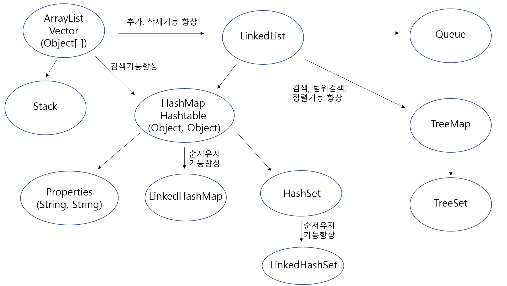

#### 자바의 정석을 공부하면서 정리한 것

# 컬렉션 프레임웍



## 컬렉션(collection)

- 여러 객체(데이터)를 모아 놓은 것을 의미

## 프레임웍(framework)

- 표준화, 정형화된 체계적인 프로그래밍 방식
- 자유도 낮은 대신 생산성 높음
- 방식이 비슷하기에 서로 협업하기에 편함

## 컬렉션 프레임웍 (collection framework)

- 컬렉션(다수의 객체)을 다루기 위한 표준화된 프로그래밍 방식
- 컬렉션을 쉽고 편리하게 다룰 수 있는(저장, 삭제, 검색, 정렬) 다양한 클래스를 제공
- java.util 패키지에 포함. jdk1.2부터 제공

## 컬렉션 클래스(collection class)

- 다수의 데이터를 저장할 수 있는 클래스
- ex) Vector, ArrayList, HashSet

## 컬렉션 프레임웍의 핵심 인터페이스(크게 3가지)

1. List
   

   - 순서 O, 중복 O
   - ex) 대기자 명단
   - 구현 클래스 : ArrayList, LinkedList, Stack, Vector 등
   - ArrayList와 LinkedList가 핵심(List인터페이스를 구현한 대표적인 컬렉션 클래스)
   - vector의 발전된 형태가 ArrayList

1. Set
   

   - 순서 X, 중복 X
   - ex) 양의 정수집합, 소수의 집합
   - 구현 클래스 : HashSet, TreeSet 등
   - HashSet과 TreeSet이 핵심

1. Map
   
   - 키(key)와 값(value)의 쌍으로 이루어진 데이터의 집합
   - 순서 X, 키는 중복 X, 값은 중복 O
   - ex) 우편번호, 지역번호, id와 passwd
   - 구현 클래스 : HashMap, TreeMap, Hashtable, properties 등
   - HashMap과 TreeMap이 핵심
   - LinkedHashMap은 순서가 O
   - Hashtable은 동기화O, HashMap은 동기화X

- 위의 List와 Set의 공통부분만 추출해서 `Collection인터페이스`를 정의(Map은 성격이 약간 달라서)

## 중요한 컬렉션 클래스 설명

### ArrayList

- ArrayList는 기존의 Vector를 개선한 것으로 구현원리와 기능적으로 동일. ArrayList와 달리 Vector는 자체적으로 동기화처리가 되어 있다.
- 데이터의 저장공간으로 배열을 사용한다(배열기반)
- 객체 배열이므로 모든 종류의 객체 저장 가능하다.(Vector도 마찬가지)
  - ArrayList에는 객체만 저장가능
- String의 "1"과 new Integer(1)은 다르다.

  ```
  ArrayList list1 = new ArrayList(); // 크기 10인 ArrayList생성

  list1.add(5); // 이것은 사실 list1.add(new Integer(5)); // autoboxing에 의해 기본형이 참조형으로 자동 변환
  ```

  ```
  public class Vector extends AbstractList
      implements List, RandomAccess, Cloneable, java.io.Serializable
      {
          ...
          protected Object[] elementData; // 객체를 담기 위한 배열
          ...
      }
  ```

- ArrayList의 메서드

  - 추가

    - boolean add(Object o)
    - void add(int index, Object element)
    - boolean addAll(Collection c)
    - boolean addAll(int index, Collection c)

  - 삭제

    - boolean remove(Object o)

    ```
    ArrayList list1 = new ArrayList();
    ...(중략)...
    list.remove(1); //인덱스가 1인 객체를 삭제
    ```

    - Object remove(int index)

    ```
    ArrayList list1 = new ArrayList();
    ...(중략)...
    list.remove(new Integer(1)); // 1을 삭제
    ```

    - boolean removeAll(Collection c)
    - void clear() // 모든 객체 삭제

  - 검색

    - int indexOf(Object o)
    - int lastIndexOf(Object o) // 오른쪽에서 찾기 시작
    - boolean contains(Object o) // 객체가 존재?
    - Object get(int index) //객체 읽기
    - Object set(int index, Object element) // 변경. 기존의 index위치에 있는 것은 지우고 그 자리에.

  - 기타
    - List subList(int fromIndex, int toindex) // 특정 부분만을 뗴어내서 새로운 List만드는 것
    - Object[] toArray()
    - Object[] toArray(Object[] a)
    - boolean isEmpty() //비어있는지
    - void trimToSize() // 빈공간 제거
    - int size() // 저장된 객체의 개수

- ArrayList에 저장된 객체의 삭제 과정

1. ArrayList에 저장된 첫 객체부터 삭제하는 경우(배열 복사 발생)

   data[0]=0
   data[1]=1
   data[2]=2
   data[3]=3
   data[4]=4
   data[5]=null
   data[6]=null

   ```
   for(int i = 0; i<list.size(); i++)
       list.remove(i);
   ```

   위와 같은 방식으로 하면 다 지우지 못한다. 왜냐하면 하나씩 지울때마다 뒤의 배열들이 복사되어 앞으로 당겨지기 때문이다.

1. ArrayList에 저장된 마지막 객체부터 삭제하는 경우(배열 복사 발생안함)
   data[0]=0
   data[1]=1
   data[2]=2
   data[3]=3
   data[4]=4
   data[5]=null
   data[6]=null
   ```
   for(int i = list.size() - 1; i>=0; i--)
       list.remove(i);
   ```
   위와 같은 방식으로는 배열 복사가 일어나지 않고 마지막 객체부터 하나씩 다 지워나갈 수 있다.

### LinkedList와 ArrayList 차이

#### 배열(ArrayList)의 장단점

- 장점
  - 배열은 구조가 간단, 데이터를 읽는데 시간이 짧다
- 단점
  1. 크기를 변경할 수 없다.(실행 중에 못 바꾼다. 컴파일 때는 바꿀 수 있다)
     크기를 변경해야 하는 경우 새로운 배열(더 큰 배열) 생성 후 데이터를 복사, 그리고 참조주소 변경도 해야된다. 그렇다고 애초부터 너무 큰 배열을 만드는 경우 메모리의 낭비 발생
  1. 비순차적인 데이터의 추가, 삭제에 시간이 많이 걸린다. (물론 끝에 데이터를 순차적으로 추가하는 것과 끝부터 순차적으로 삭제하는 것은 빠르다)

#### LinkedList

- LinkedList는 배열의 단점을 보완(크기 변경X, 추가삭제시 시간소모 큼)
- 배열기반인 ArrayList와 Vector에서 추가, 삭제 기능 향상시킨 것이 LinkedList
- LinkedList로 만든 것이 Queue
- 배열과 달리 LinkedList는 불연속적으로 존재하는 데이터를 하나하나씩 연결(link). `기차`로 비유
- 데이터 하나씩을 `Node`라고 한다. 각 Node는 데이터와 다음노드의 주소값을 가지고 있다.
- 데이터 삭제
  - 단 한 번의 참조변경만으로 가능
  - 삭제할 노드와의 연결을 끊으면 된다. 이후 가비지 컬렉터가 삭제함
- 데이터 추가

  - 한 번의 Node객체생성과 두 번의 참조변경만으로 가능

- 단점
  - 연결리스트, 데이터 접근성이 나쁨. 불연속적이므로(자신의 다음 Node만 알고 있으므로). `기차`로 비유하자면 1칸->3칸으로 이동하려면 반드시 2칸을 거쳐야 한다. 그리고 2칸에서 1칸으로(반대로) 접근하지 못한다. `더블리 링크드 리스트(doubly linked list), 이중 연결리스트`는 이 단점을 보완해서 각 Node의 앞, 뒤로 이동 가능(그러나 여전히 여러칸을 한번에 뛰어넘지는 못한다). `더블리 써큘러 링크드 리스트(double circular linked list), 이중 원형 연결리스트`는 한 번 더 이 단점을 보완한 것.

#### ArrayList vs LinkedList

1. 순차적으로 데이터를 추가/삭제
   - ArrayList가 빠름
1. 비순차적으로 데이터를 추가/삭제
   - LinkedList가 빠름
1. 접근시간(access time) - ArrayList가 빠름

### HashSet

- Set 인터페이스를 구현한 대표적인 컬렉션 클래스
- HashMap에서 key값들만으로 만든 것이 HashSet
- 순서X, 중복X
- 순서를 유지하려면, LinkedHashSet 클래스를 사용하면 된다
- 주요 메서드
  - boolean add(Object o)
  - boolean addAll(Collection c)
  - boolean remove(Object o) // 삭제
  - boolean removeAll(Collection c) // 교집합
  - boolean retainAll(Collection c) // 조건부삭제
  - void clear() // 모두 삭제
  - boolean contains(Object o)
  - boolean containsAll(COllection c)
  - Iterator iterator()
- 객체를 저장하기 전에 기존에 같은 객체가 있는지 확인. 같은 객체가 없으면 저장하고, 있으면 저장하지 않는다.

  - boolean add(Object o) 는 저장할 객체의 equals()와 hashCode()를 호출한다. 그런데 equals()와 hashCode()가 오버라이딩 되어 있지 않으면 HashSet이 제대로 동작하지 않는다. (오버라이딩 되어있어야만 중복을 확인할 수 있다). equals()는 iv를 비교하도록 해야 하며, hashcode는 Objects 객체를 이용해서 비교.

  ```
      public class test {
      public static void main(String[] args) {
          HashSet set = new HashSet();

          set.add("abc");
          set.add("abc"); //중복이라 저장안됨
          set.add(new Person("June", 10));
          set.add(new Person("June", 10));

          System.out.println(set);
          }
      }

      class Person {
          String name;
          int age;

          @Override
          public int hashCode() {
              return Objects.hash(name, age); //Objects라는 클래스 사용
              // return (name + age).hashcode(); //원래는 이런식으로 했다. (name+age)가 String이므로 String 클래스의 hashcode() 부른 것이었음.
          }

          @Override
          public boolean equals(Object obj) {
              if(!(obj instanceof Person)) return false;
              //Person객체가 아니면 비교할 필요도 없으므로

              Person p = (Person)obj;
              //형변환해서 접근리모콘 만들어야 밑에서 p.name과 p.age로 사용할 수 있으니.

              return name.equals(p.name) && age==p.age;
              // iv들(name, age)을 각각 비교한 것.

              //위의 것은 사실 this.이 생략된 것. 객체 자신(this)과 매개변수로 지정된 객체(obj)를 비교하는 것이다.
              return this.name.equals(p.name) && this.age==p.age;
          }

          Person(String name, int age){
              this.name = name;
              this.age = age;
          }

          public String toString() {
              return name + ":" + age;
          }
      }
  ```

### TreeMap

- LinkedList에서 검색, 범위검색, 정렬기능 향상시킨 것

### TreeSet

- TreeSet은 TreeMap에서 key 값들만으로 만든 것


- 이진 탐색 트리(binary search tree)로 구현되어 있다.. 범위 탐색과 정렬에 유리(정렬 필요없음)
- 이진 트리는 모든 노드가 최대 2개(0~2)의 하위 노드를 갖는다. 각 요소(node)가 나무(tree)형태로 연결(LkinkedList의 변형)

```
class TreeNode {
    TreeNode left;  // 왼쪽 자식노드
    Object element; // 저장할 객체
    TreeNode right; // 오른쪽 자식노드
}
```

- 이진 탐색 트리

  - 부모보다 작은 값은 왼쪽, 큰 값은 오른쪽에 저장

    

  - 실제 그림은 아래와 같다.

    

- 단점
  - 데이터가 많아질수록 추가, 삭제에 시간이 더 걸림(HashSet보다)
  - 저장할때마다 `root부터 시작해서` 부모까지 다 비교해서 대소를 비교해서 적정자리에 저장, 삭제해야 하므로
- 데이터 저장과정 boolean add(Object o)

  - 중복을 허용하지 않으므로 기존에 같은 객체가 있는지 확인한다. TreeSet은 compare()를 호출해서 비교한다

- TreeSet은 비교기준이 꼭 필요한데, 저장하는 객체가 Comparable을 구현했거나 TreeSet이 특정한 정렬기준을 가지고 있어야 한다.

### HashMap과 HashTable(구버전)

- 순서 X, 중복(키X, 값O)
- Map 인터페이스를 구현, 데이터를 키와 값의 쌍으로 저장
- 키와 값을 Object로 저장(Properties는 문자열로만 저장가능)
- HashMap(동기화X)은 HashTable(동기화O)의 신버전
- HashMap이 Map인터페이스를 구현한 대표적인 컬렉션 클래스
- HashMap과 Hashtable은 ArrayList와 LinkedList에서 검색기능을 향상시킨 것이다. 각각의 장점(배열+linkedList)을 합친 것.
- 순서를 유지하려면, LinkedHashMap 클래스를 사용하면 된다.
- 해싱(hashing)기법으로 해시테이블(hash table)에 데이터를 저장. 데이터가 많아도 검색이 빠르다.
  - 해싱은 해시함수를 이용해서 저장 & 읽어온다.
  - key값을 알려주면 배열의 index(저장위치=해시코드)를 알려준다. 같은 key값은 항상 같은 index가 나온다. (서로 다른 키일지라도 같은 값의 해시코드를 반환할 수 있다)
  - 해시테이블은 배열(접근성 좋음)과 링크드 리스트(변경 유리)가 조합된 형태
- 미리 존재해 있는 키 값을 넣으면 늦게 입력한 키, 값이 덮어쓴다.

  

- 키와 값을 묶어서 `entry` 라고 한다.

- 해시테이블에 저장된 데이터를 가져오는 과정
  

  1. 키로 해시함수를 배열해서 해시코드를 얻는다.
  1. 해시코드(해시함수의 반환값)에 해당하는 링크드리스트를 배열에서 찾는다.
  1. 링크드리스트에서 키와 일치하는 데이터를 찾는다.

- 주요 메서드
  - Object put(Object key, Object value) //추가
  - void putAll(Map m) //추가
  - Object remove(Object key) // 삭제
  - Object replace(Object key, Object value)
  - boolean replace(Object key, Object oldValue, Object newValue)
  - Set entrySet() // 키와 값이 포함된 쌍들을 얻을 수 있다.
  - Set keySet() // 키값들만
  - Collection values() // 값들만
  - Object get(Object key)
  - Object getOrDefault(Object key, Object defaultValue)
  - boolean containsKey(Object key)
  - boolean containsValue(Object value)

* 예제1

  ```
      public class test {
      public static void main(String[] args) {
          HashMap map = new HashMap();
          map.put("june", "1234");
          map.put("min", "1111");
          map.put("heo", "1234");

          Scanner s = new Scanner(System.in);

          while(true) {
              System.out.println("id와 password를 입력해보세요");
              System.out.println("Id : ");
              String id = s.nextLine().trim();

              System.out.println("password : ");
              String password = s.nextLine().trim();
              System.out.println();

              if(!map.containsKey(id)) {
                  System.out.println("입력하신 id는 존재하지 않습니다. 다시 입력해주세요");
                  continue;
              }

              if(!(map.get(id)).equals(password)) {
                  System.out.println("비밀번호가 일치하지 않습니다. 다시 입력해주세요");
              } else {
                  System.out.println("id와 비밀번호가 일치합니다.");
                  break;
              }

          }
      }
  }
  ```

* 예제2

  ```
  public class test {
      public static void main(String[] args) {
          HashMap map = new HashMap();
          map.put("가", new Integer(90));
          map.put("나", new Integer(100));
          map.put("다", new Integer(30));
          map.put("라", new Integer(40));
          map.put("마", new Integer(50));

          Set set = map.entrySet();
          Iterator it = set.iterator();

          while(it.hasNext()) {
              Map.Entry e = (Map.Entry)it.next(); //Entry는 Map인터페이스 안에 정의된 내부 인터페이스
              System.out.println("이름 : " + e.getKey() + ", 점수 : " + e.getValue());
          }

          set = map.keySet();
          System.out.println("참가자 명단 : " + set);

          Collection values = map.values();
          it = values.iterator();

          int total = 0;

          while(it.hasNext()) {
              int i = (int)it.next();
              total += i;

          }
          System.out.println("총점 : " + total);
          System.out.println("평균 : " + (float)total/set.size());
          System.out.println("최고점수 : " + Collections.max(values)); //max안에는 comparable을 구현한 객체만 들어올 수 있다(기준이 있어야 하므로). 밑의 min도 마찬가지
          System.out.println("최저점수 : " + Collections.min(values));
      }
  }
  ```

  결과는

  ```
  이름 : 가, 점수 : 90
  이름 : 다, 점수 : 30
  이름 : 나, 점수 : 100
  이름 : 마, 점수 : 50
  이름 : 라, 점수 : 40
  참가자 명단 : [가, 다, 나, 마, 라]
  총점 : 310
  평균 : 62.0
  최고점수 : 100
  최저점수 : 30
  ```

### Properties

- HashMap 에서의 변형
- 키, 값을 문자열(String)만으로 저장
- 파일의 읽기와 쓰기가 용이

## Stack & Queue

### Stack

- 클래스
- 밑에 막힌 box(상자). 위만 뚫려 있는 구조
- LIFO(Last in First Out)구조. 마지막에 저장된 것을 제일 먼저 꺼내게 된다.
- ArrayList, Vector를 이용해서 만든 것이 stack
- 저장(push), 추출(pop)
- 스택을 구현하려면 배열과 링크드리스트 중에서 배열이 더 효율적. 순차적으로 저장, 삭제가 되므로
- 메서드
  - boolean empty()
  - Ojbect peek() // 제일 위의 객체를 `확인`만
  - Object pop() // 제일 위의 객체를 `꺼내기`
  - Object push(Object item) // 저장
  - int search(Object o)
- 스택의 활용
  - 수식계산, 수식괄호검사, 워드프로세스의 undo/redo, 웹브라우저의 뒤로/앞으로

### Queue

- 인터페이스(객체 생성 안됨)
  - Queue를 직접 구현 or Queue를 구현한 클래스 사용(LinkedList)
- 파이프 구조(위 아래가 다 뚫려 있음)
- FIFO(FIrst in First Out)구조. 제일 먼저 저장한 것을 제일 먼저 꺼내게 된다.
- LinkedList로 만든 것이 Queue
- 저장(offer), 추출(poll)
- 큐를 구현하려면 배열과 링크드리스트 중에서 링크드리스트가 더 효율적. 자리이동 없이 연결만 바꿔주면 되므로.
- 메서드
  - boolean add()
  - Object remove() // 삭제. 예외가 발생(try ~ catch 로 처리)
  - Object element()
  - boolean offer(Object o)
  - Object poll() // 삭제. null을 반환하지 예외가 발생안된다 (if(obj=null)로 처리)
  - Object peek()
- 큐의 활용

  - 최근사용문서, 인쇄작업 대기목록, 버퍼

  ```
  public class Test {
      public static void main(String[] args) {
          Stack st = new Stack();
          Queue q = new LinkedList(); //Queue 인터페이스  구현체인 LinkedList

          st.push("0");
          st.push("1");
          st.push("2");

          q.offer("0");
          q.offer("1");
          q.offer("2");

          System.out.println("= Stack = ");
          while(!st.empty()) {
              System.out.println(st.pop()); // 스택에서 요소 하나를 꺼냄
          }

          System.out.println("= Queue = ");
          while(!q.isEmpty()) {
              System.out.println(q.poll());
          }
      }
  }
  ```

  그럼 결과는

  ```
  = Stack =
  2
  1
  0
  = Queue =
  0
  1
  2
  ```

### Iterator, ListIterator, Enumeration

- 컬렉션에 저장된 데이터를 접근(읽는)하는데 사용되는 인터페이스
- Enumeration은 Iterator의 구버전. `Iterator`를 사용하기
- Iterator의 핵심 메서드 2개
  - boolean hasNext() // 확인, 읽어올 요소가 있으면 true(없다면 false)
  - Object next() // 읽기, 다음요소를 읽어온다.
- Enumeration의 핵심 메서드 2개
  - boolean hasMoreElements() // Iteartor의 hasNext()와 동일
  - Object nextElement() // Iterator의 next()와 동일
- ListIterator는 Iterator의 접근성을 향상시킨 것(단방향 -> 양방향)
- 컬렉션에 저장된 요소들을 읽어오는 방법을 `표준화`한 것이다. 그래서 구조(List, Set, Map)가 어떻든 간에 hasNext()와 next()로 접근하여 사용하면 된다.
- 사용법

  - 컬렉션에 iterator()를 호출해서 Iterator를 구현한 객체를 얻어서 사용

  ```
  List list = new ArrayList(); // 다른 컬렉션으로 변경할 때는 이 이 부분만 고치면 된다.

  Iterator it = list.iterator();

  while(it.hasNext()){ //boolean hasNext() 읽어올 요소가 있는지 확인
      System.out.println(it.next()); // Object next() 다음 요소를 읽어옴
  }
  ```

  - iterator()메서드는 Collection인터페이스에 정의되어 있는 것이라서 Collection인터페이스의 자손인 List, Set이 모두 가지고 있는 메서드이다. (Map에는 iterator()가 없다)

  ```
  public interface Collection {
      ...
      public Iterator iterator();
      ...

  }

  ```

  ```
      public class test {
      public static void main(String[] args) {
          List list = new ArrayList();
          list.add(1);
          list.add(2);
          list.add(3);
          list.add(4);
          list.add(5);

          Iterator it = list.iterator();
          while(it.hasNext()) {
              Object obj = it.next(); // 읽음
              System.out.println(obj);
              }
          }
      }
  ```

  결과는?

  ```
  1
  2
  3
  4
  5
  ```

  - Iterator를 다 쓰고 나면 (pointer가 다 이동했으면) 다시 얻어서 생성해야 한다.

  ```
      public class Ex11_5 {
      public static void main(String[] args) {
          List list = new ArrayList();
          list.add(1);
          list.add(2);
          list.add(3);
          list.add(4);
          list.add(5);

          Iterator it = list.iterator(); //1회용임
          while(it.hasNext()) {
              Object obj = it.next(); // 읽음
              System.out.println(obj);
          }

          Iterator it = list.iterator();
          while(it.hasNext()) { // false가 된다.
              Object obj = it.next();
              System.out.println(obj);
          }
      }
  }
  ```

  결과는

  ```
  1
  2
  3
  4
  5
  ```

- Map에는 iterator()가 없다. 그래서 keySet(), entrySet(), values()를 호출해야 한다. 각각의 반환타입은 Set, Set, Collection이다. Map을 통해서 바로 iterator()를 가져오지 않고 이들을(KeySet(), entrySet(), values()) 통해서 Set이나 Collection을 얻은 다음에 이를 통해 iterator() 호출
  ```
  Map map = new HashMap();
      ...
  Iterator it = map.entrySet().iterator();
  ```
  위의 두번째 줄은 사실 아래와 같다.
  ```
  Set eSet = map.entrySet();
  Iterator it = eSet.iterator();
  ```

### Arrays 클래스

- 배열을 다루기 편리한 메서드(static) 제공. 마치 Math, Objects, Collections 클래스와 비슷(모두 static메서드 제공). util 메서드라고도 한다.

1. 배열의 출력 - toString()
1. 배열의 복사 - copyOf(), copyOfRange()
   - 새로운 배열을 만들어서 반환
1. 배열 채우기 - fill(), setAll()
   ```
   int[] arr = new int[5];
   Arrays.fill(arr, 9);
   Arrays.setAll(arr, (i) -> (int)(Math.random()*5+1); // arr = [1, 5, 2, 1, 1]
   ```
1. 배열의 정렬과 검색 - sort(), binarySearch()

   ```
   int[] arr = {3, 2, 0, 1, 4};
   int idx = Arrays.binarySearch(arr, 2);

   Arrays.sort(arr); //정렬
   System.out.println(Arrays.toString(arr));   //[0, 1, 2, 3, 4]
   int idx = Arrays.binarySearch(arr, 2); //idx=2

   ```

1. 다차원 배열의 출력 - deepToString()

   ```
   int[] arr = {0, 1, 2, 3, 4};
   int[][] arr2D = {{11, 12}, {21, 22}};

   System.out.println(Arrays.toString(arr)); // {0, 1, 2, 3, 4}
   System.out.println(Arrays.deepToString(arr)); //{{11, 12}, {21, 22}};

   ```

1. 다차원 배열의 비교 - deepEquals();

1. 배열을 List로 변환 - asList(Object... a)

1. 람다와 스트림 - paralleXXX(), spliterator(), stream()

### Collections 컬렉션을 위한 메서드(static) 제공

- 컬렉션을 다루기에 유용한 static 메서드 제공
- 참고) Objects, Arrays, Collections 모두 다 각각, 배열, 컬렉션을 다루기 위한 static 메서드 제공

1. 컬렉션 채우기, 복사, 정렬, 검색 - fill(), copy(), sort(), binarySearch() 등

1. 컬렉션의 동기화 - synchronizedXXX()

   static Collection `synchronized`Collection(Collection c)

   static List `synchronized`List(List list)

   static Set `synchronized`Set(Set s)

   static Map `synchronized`Map(Map m)

   static SortedSet `synchronized`SortedSet(SortedSet s)

   static SortedSet `synchronized`SortedMap(SortedMap m)

   - 사용법

   매개변수인(동기화X) new ArrayList 를 넣어서 동기화 된 synList를 만드는 것

   동기화된 synList는 Vector(원래 동기화O)와 동일해지게 된 것

   ```
   List synList = Collections.synchronizedList(new ArrayList(...));

   ```

1. 변경불가(readOnly) 컬렉션 만들기 - unmodifiableXXX()

   static Collection `unmodifiable`Collection(Collection c)

   static List `unmodifiable`List(List list)

   static Set `unmodifiable`Set(Set s)

   static Map `unmodifiable`Map(Map m)

   static NavigableSet `unmodifiable`NavigableSet(NavigableSet s)

   static SortedSet `unmodifiable`SortedSet(SortedSet s)

   static NavigableMap `unmodifiable`NavigableMap(NavigableMap m)

   static SortedMap `unmodifiable`SortedMap(SortedMap m)

1. 싱글톤 컬렉션 만들기 - singletonXXX()

   static List singleton(Object o)

   static Set singleton(Object o)

   static Map singletonMap(Object key, Object value)

1) 한 종류의 객체만 저장하는 컬렉션 만들기 - checkedXXX()

   static Collection `checked`Collection(Collection c, Class type)

   static List `checked`List(List list, Class type)

   static Set `checked`Set(Set s, Class type)

   static Map `checked`Map(Map m, Class keyType, Class valueType)

   static Queue `checked`Queue(Queue queue, Class type)

   static NavigableSet `checked`NavigableSet(NavigableSet s, Class type)

   static SortedSet `checked`SortedSet(SortedSet s, Class type)

   static NavigableSet `checked`NavigableMap(NavigableMap m, Class keyType, class valueType)

   static SortedMap `checked`SortedMap(SortedMap m, Class keyType, Class valueType)

   - 사용법

   원래 add(Object obj)라서 다 넣을 수 있지만 지정한 종류의 타입만 가능

   ```
   List list - new ArrayList();
   List CheckedList = checkedList(list, String.class); // String만 저장가능

   checkedList.add("abc");
   checkedList.add(new Integer(3)); //에러남 ClassCastException 발생
   ```

### Comparator와 Comparable

- 객체 정렬에 필요한 메서드(정렬기준 제공)를 정의한 인터페이스

  - Comparable 기본 정렬기준을 구현하는데 사용
  - Comparator 기본 정렬기준 외에 다른 기준으로 정렬하고자 할 때 사용

  ```
  public interface Comparator {
      int compare(Object o1, Object o2) // o1, o2 두 객체를 비교. 0이면 같고 양수면 왼쪽이 큰 것이고 음수면 반대
      boolean equals(Object obj); //equals를 오버라이딩하라는 뜻
  }
  public interface Comparable {
      int compareTo(Object o); //주어진 객체(o)를 자신(this)과 비교
  }

  ```

- compare()와 compareTo()는 두 객체의 비교결과를 반환하도록 작성. 같으면 0, 오른쪽이 크면 음수(-), 작으면 양수(+)

  ```
  public final class Integer extends Number implements Comparable {
      ...
      public int compareTo(Integer anotherInteger) {
          int v1 = this.value;
          int v2 = anotherInteger.value;

          //같으면 0, 오른쪽 값이 크면 -1, 작으면 1을 반환
          return (v1 < v2 ? -1 : (v1==v2 ? 0 : 1));
      }

  }

  ```

- 정렬은 대상과 기준이 있다. 그리고 정렬할 때는 `두 대상을 비교하고 자리를 바꾼다.` 이 부분은 절대불변이며(버블정렬, 선택정렬 등 모두 다 동일), 우리는 그 정렬하는 기준만 제시해주면 되는 것이다. 절대불변인 구체적 방법은 이미 다 구현되어 있는 상태.

참고 : 자바의 정석 - 남궁성
