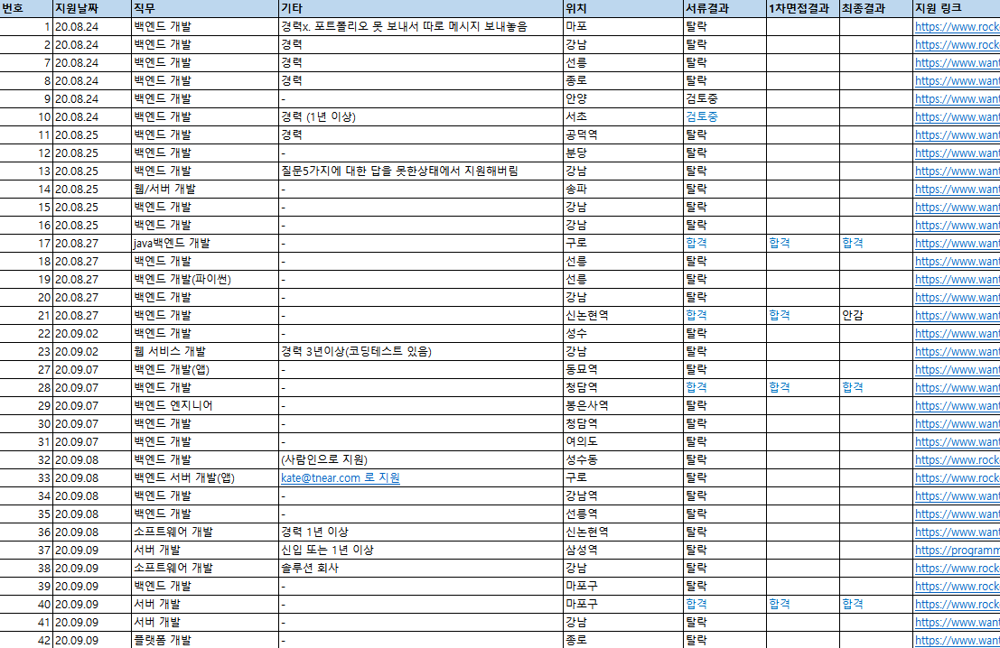
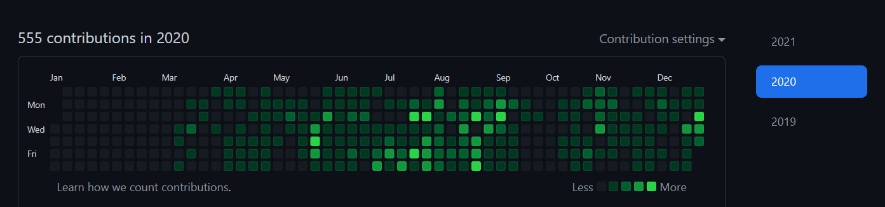
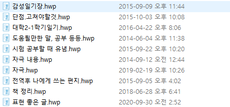

> 많은 개발자들이 매년 회고를 남기는 것을 보고 나 역시 매년 스스로의 흔적을 남기고 발전하고자 이 글을 쓴다.
> 지나가는 나이 많비전공자들이 보고 도움이 1이라도 되었으면 하는 마음에서.
> 양식은 이 [회고](https://ryan-han.com/post/memoirs/memoirs2018/)와 비슷하다. 너무 많이 읽어서이기도 하고 내가 말하고 싶은 것을 엄청 잘 설명을 한 글이기에 참고를 많이 했다.

# 1. 개발 입문

누구나 그렇듯이, 우여곡절이 많았다. 수능 `5수`를 해서 11학번으로 대학교에 입학했고, 본격적으로 졸업하기 전부터 취업 준비해서 `만5년` 의 오랜 시간 끝에 자리를 잡게 되었다. 31.9살에 개발 공부를 처음 시작하여, 32후반이었던 작년 2020년 10월에 스타트업에서 개발자 커리어를 시작하게 되었다.

## 왜 5수?

- 재미있는 것을 찾았기 때문

학창시절 내내 게임, 운동 말고는 관심이 별로 없다가 고3 때 다들 `in 서울` 대학을 목표로 하는 것을 보고 따라 진지하게 공부를 해보니 너무(~~갑자기..~~) 재미가 있었던 것. 하지만 그때는 이미 수능 한달 전. 역대급으로 어려웠던 수능 수학 시간에 나는 1시간이 넘게 시간이 남아서 여유로웠다. 5번까지만 풀고 나머지는 다 찍었기 때문. 다른 과목들도 마찬가지였고 남는 시간은 생산적으로 보내고 싶어 재수계획을 세웠고, 수능을 마치고는 빨리 달려가 친구들이랑 [도타](https://namu.wiki/w/%EB%94%94%ED%8E%9C%EC%8A%A4%20%EC%98%A4%EB%B8%8C%20%EB%94%94%20%EC%97%90%EC%9D%B8%EC%85%98%ED%8A%B8)를 하러 pc방에 갔다.. ???

- 목표는 우리나라 최고대학, 현실은 지하 10층. 올라오는 데 걸린 시간 `5수`

  

  왜 5수를 했냐는 질문은 살아오면서 수백번은 들은 것 같다.(~~사실 왜보다는 어떻게~~). 재수를 시작했을 때는 우리나라 최고대학을 목표로 삼았다. 하지만 나는 현실도 모르는 [무식한 놈](https://namu.wiki/w/%EC%9E%98%20%EB%AA%A8%EB%A5%B4%EA%B3%A0%20%EB%AC%B4%EC%8B%9D%ED%95%9C%20%EC%82%AC%EB%9E%8C%EC%9D%B4%20%EC%8B%A0%EB%85%90%EC%9D%84%20%EA%B0%80%EC%A7%80%EB%A9%B4%20%EB%AC%B4%EC%84%AD%EC%8A%B5%EB%8B%88%EB%8B%A4)이었기 때문에 매운 맛을 많이 봤다. 중학교 1학년 수학부터 시작해 학을 뗄 정도로 공부를 했지만 `의지`만으로 1년만에 모든 것이 가능하다고 생각했던 멍청했던 나는 기초가 워낙 없어서 매년 실패했다. 재수학원비가 비싸 일을 하며 주경야독으로 공부를 했고, 총 5번의 수능을 본 후 마침내 과분한 대학교에 입학하게 되었다. 전공은 사범대학 체육교육과였다. 운동을 좋아했기 때문. 힘든 기간이었지만 공부가 너무 재미있어서 버틸 수 있었다.(~~그런데 더 재미있는 것들은 널렸다~~)

## 그런데 취업은 왜 또 5수? 갑자기 개발?

학부생 때, 주변의 권유로 꽤 큰 시험을 치르기 위해 군 복학 이후로 각종 자격증, 영어 점수, 대외활동 등을 몇 년간 준비하고 공부했다. 하지만 나 자신과 미래에 대한 성찰을 깊게 하지 않은 상태에서 단순하게 번듯한 직업만을 바라봤던 나는 결국 한계에 부딪혔다. 그래서 의욕이 점점 없어져서 시험에도 여러번 떨어지게 되었다. 이때부터 몇 년간 `지옥의 시간`을 보냈다. `매몰비용`을 생각해 기존의 시험을 완전하게 포기하지도 않은 상태에서 관심도 없는 직무의 기업 등에 지원하는 것을 병행했다(생계를 위해). 그러다가 대학원연구실, 컨설팅 RA, 인턴 등을 `어둠 속에서 배회` 하던 중 우연히 개발 분야를 알게 되었다. 스타트업에서 인턴하는 중 개발자 어깨너머에서 아무생각 없이 구경하다가 코드를 살짝 수정하니 웹에 보여지는 페이지가 확 달라지는 것을 보고 엄청 신기했던 적이 있었다. `저건 뭐지?`. 그래서 퇴근하고 [강의](https://www.youtube.com/watch?v=jSJM9iOiQ1g&list=PLuHgQVnccGMDUzDDCKW-pCZQY-MMCX5yB&index=3)를 보며 html에서 내가 쓴 글씨가 `웹`에 나오는 것을 보고 엄청 희열을 느꼈고, 마법처럼 빨려 들어갔다. `이거다...!`

무엇보다, 내가 해온 공부들이랑 다르게 원인과 결과, 그리고 답이 너무나 깔끔하고 명확하다는 것에서 굉장한 큰 매력을 느꼈었기 때문에 나의 업으로 결정했다.

# 2. 국비지원학원

## 공부 방법

- 처음에는 youtube나 인터넷 강의로 준비를 하려고 했다. 하지만 컴퓨터에 대한 지식에 전무한 나는 단순히 혼자서 어둠 같은 바닷속에서 준비하는 것이 불안하고 무서웠고 어떻게든 체계화된 시스템이 필요하다고 생각을 했다.

### 왜 `국비지원`을 선택했는가

- 금전적인 여유가 전혀 없었다. 개인적으로 안정화된 일자리 없이 몇 년간 이것저것 준비만 했기에 후기 좋은 사설 학원(짧은 몇개월에 몇백만원...)은 도저히 생각도 할 수도 없었다. 하지만 주변에서 국비지원교육을 받은 지인들이 몇 명 있어서 정보를 구했다. 하지만 하나같이 추천하지 않았고...그럼에도 나는 금전적인 이유로 다른 선택지가 없었고 학원의 부족함은 나의 노력으로 채우겠다는 다짐을 했다.

### 국비지원교육의 아쉬운 점

- `학생들의 실력 발전이 1순위가 아니다`. 고용노동부에서 요구(그리고 보고한)하는 커리큘럼 이수가 우선인 선생님은 학생들의 수준과 배려를 생각할 여유가 없으셨던 것 같다. 학생들이 제대로 배우지 못하더라도 어떻게든 꾸역꾸역 `아무데나` 취업만 하더라도 `취업률`은 올라가고, 학생들의 성취보다 고용노동부에서 점검 나와 치르는 시험점수가 더 중요한 포지션에 있으시므로 어쩔 수 없는 면이 있었던 것 같다. 그럼에도 국가에서 무료로 지원해주는 교육이므로 눈물을 머금고(~~감사한 마음으로~~) 이수했다.

- `실습을 많이 하는 선생님` 을 선택해야 한다.(~~그런데 잘 찾기가 힘들다~~) 나는 학원에서 나이도 제일 많아 열심히 하고자 반장을 도맡아 수업 분위기를 잘 이끌고자 노력했다. 하지만 첫 한 달 가량의 수업 이후 중간에 선생님이 바뀌었는데, 사실 잘 맞지 않았다. 그 선생님을 비난하는 것은 아니지만(~~포지션상 어쩔 수 없는 부분도 있기에..~~) 폭주기관차처럼 수업만 나가시는 바람에 전공자들도 수업을 따라가기 쉽지 않았다. 하지만 6~7개월간의 기간 중 지식들이 가장 기억에 남았던 시간은 첫 한달동안 매일 하루에 1시간씩 실습이자 미니시험을 치뤘던 기억이다. 개발은 `무조건 직접 만들면서 삽질을 해야 빨리 배운다.` 그래서 지식을 잘 전달하는 것도 중요하지만 무엇보다 직접 실습을 많이 하게 하고 학생들의 실력 발전에 관심이 많으신 선생님을 선택해야 한다.(~~후기들을 잘 읽어봐야 하지만 사실 `복불복`인 경우가 많다..ㅠㅠ~~).

- `여유가 된다면 국비지원을 선택할 이유가 전혀 없다.`. 왜냐하면 돈보다 시간이 훨씬 더 중요하기 때문이다. 어설픈 학원에서 어설픈 포트폴리오와 실력으로는 괜찮은 회사에 취업을 할 수가 없고 그러면 심지어 학원 이수 이후에도 새로 포트폴리오를 쌓고 공부하는데에 있어서 또 몇 개월간 소모를 해야 한다. 우리 반에서는 심지어 절반 이상이나 학원 수료 후 몇 개월간 취업을 못했다. 그 `잃어버린` 시간을 생각한다면 단순히 공짜라고 해서 국비지원학원이 좋은 대안이라고는 쉽게 말하지 못하겠다. 돈이 더 들고 고생하더라도 더 좋은 대안(잘 가르치는 사설 학원, 스터디 등)을 선택해서 좋은 회사에 빨리 취업하는 것이 훠얼신 이득이라 생각한다.(경력, 월급, 실력 등의 측면에서). 빨리 취업해서 현업에서 배우는 것이 혼자 공부하는 것보다 몇배나 더 효율적이기 때문이다.

- 참고로 국비지원 교육에 대해서는 많은 참고자료(?)들이 있지만 [인프런 강의 - 홍보 아님](https://www.inflearn.com/course/%EA%B0%9C%EB%B0%9C%EC%9E%90-%EC%B7%A8%EC%97%85-%ED%86%B5%ED%95%A9%ED%8E%B8/dashboard) 에서 말한 부분이 너무나 공감되어 링크를 남긴다.

# 3. 개발서 목록

- 원래 책을 좋아하는 편이다. 위의 사진은 군 전역 후부터 계속 읽어왔던 책 목록과 리스트이다. 하지만 이제는 개발 분야로 오고 나서부터는 거의 다 기술서로 바뀌었다. 아직 실력이 너무나도 부족하고 공부할 것들이 많아서 1~2년간은 기술서 위주로만 주로 읽을 생각이다. (~~내 같은 쪼렙 개발자가 다른 책들을 읽는 건 아직은 사치라고 생각한다~~)
- 아래 사진은 요즘 관리하고 있는 책 목록이다. 원래는 노션페이지로 관리했으나 요즘에는 [개발서적들 정리-블로그](https://highjune.netlify.app/etc/books/) 에 주로 최신화하며 정리하고 있다.
  

## 책으로 공부하는 이유

- 학원, 인터넷 등의 강의들도 좋지만 책으로 공부하는 가장 좋은 이유는 `내가 뭘 모르는지 알 수 있다는 것` 이다. 나같은 비전공자들은 뭐를 도대체 왜 공부해야되는지조차 모를 것이다. 하지만 개발서적을 통해 공부를 하게 되면 `책의 목차`, 그리고 `서문`에 해당 기술의 등장배경 등에 대해서 소상하게 알려준다. 사실 비전공자 개발자들은 자잘한 기술에 대한 설명들보다 이러한 `네비게이션` 같은 설명이 훨씬 중요하다. 그래야 나의 위치(~~바닥 중에서도 어딘가~~)에 대한 방향이 약간 잡히고 공부의 목적 등에 대해서 자세히 알 수 있기에 (~~그럼에도 초반에는 전혀 잡히지 않는다~~) 좀 더 집중력과 의욕이 생긴다.
- 그래서 아래와 같이 책을 사서 공부하기 시작하는데, 기초에 대한 책을 성실히 실습하며 공부해서 마지막 페이지를 덮는 순간 성취감이 장난이 아니다. 그래서 비전공자 출신 초급 개발자들에게는 책으로 공부하는 것을 추천하고 싶다.(물론 좋은 인터넷 강의들도 병행해야 함은 당연하고 생각보다 책으로 공부하는 것을 딱딱하고 고지식하게 생각하는 사람들이 많았던 것 같아서)
  

# 4. 취업

- 위에서 말한 것처럼 2020년 10월부터 스타트업에 취업해서 백엔드 서버 개발자로 일하게 되었다. 사실 학원 수료는 7월에 한 것에 비해 공백이 있었다. 지금도 그 시간이 너무나 아깝다.

## 취업과정과 늦은 이유

- `프로젝트는 무조건 직접, 간소하게.` 난 2020년 7월에 국비지원학원을 수료했는데 10월에 취업하게 되어서 빨리 한 편이 아니었다. 원래 목표는 수료하기 전에 취업하는 것이었는데 공을 제일 많이 들였던 프로젝트가 실패로 돌아가게 되어서 계획에 실패했다. 난 심지어 기존에 국비지원학원의 수많은 후기들을 많이 읽어서 프로젝트는 최대한 간소하게 해야 성공할 수 있다는 것을 알고 있었는데도 불구하고 매듭을 짓지 못해 스스로에게 크게 분노했다. 조원 중에 전공자가 있었는데 수많은 오픈소스, 모듈들을 쉽게 붙일 수 있다고 제안해서 정말 `바보`같이 철썩같이 믿고 있다가 결국 모두가 손을 대지 못한 상태로 프로젝트가 끝이 났다. 지금 보면 `분별력 없는 실력`이었던 조장인 내가 잘 리드하지 못했던 것 같아 미안하고 지금 생각해도 아쉽다.
- `직접 만들면 면접에서 자신있다.` 그래서 수료 직전에 다른 동생과 부랴부랴 어설픈 게시판을 만들었다. 원칙은 `모든 것을 직접 만들기`였다. 서로 같은 기술 스펙을 약속하고 조금씩 특정 기능을 구현해 오기로 약속하고 매일마다 `바보들의 코드리뷰` 시간을 가졌다. 하지만 이 시간이 제일 실력이 많이 늘었고 정말 재미있었다!... 그래서 포트폴리오를 어설프게나마 만들 수 있었고 면접 때 해당 프로젝트에 대한 질문들은 자신있게 해결할 수 있었다.
- `사이드 프로젝트 하나 더.` 동생이랑 하는 프로젝트를 거의 끝마칠 무렵에 [AWS로 웹을 구현하는 책](http://www.yes24.com/Product/Goods/83849117)을 사서 한달동안 처음부터 끝까지 다 직접 구현해 보았다. 워낙 추천하는 글들을 많이 봤고 무엇보다 서버에 직접 배포하는 과정을 직접 해보니 공부가 많이 되었다.(~~하지만 아직도 CI, CD는 너무 어렵다~~)
- `8월말부터 서비스 개발 회사` 에 집중적으로 지원을 했다. 그런데 생각보다 공고가 많지 않아서 경력직인데도 불구하고 모조리 지원하고 따로 메일까지 보냈다. 모조리 다 떨어지고 답장조차 없었지만...^^;(~~실패에 강한편, 실패전문가~). `서비스 개발` 회사에 주로 지원한 이유는 연봉(~~내 실력에선 어차피 거기서 거기~~), 출장근무 기피 등의 이유가 아닌 오직 `성장 가능성` 이었다. 자체 서비스를 직접 개발하고 배포하는 과정에서 `흥미`를 느끼고 그 과정에서 많이 배울 수 있을 것이라 판단하였기 때문이다. 붙은 곳 중에서는 사수분이 꼭 계셔야 한다는 생각에 시니어 분들이 더 많이 계시는 곳을 선택했다.
  
- 면접때는 그동안 관리한 깃허브, 학원에서 배운 것을 필기한 노션 페이지 등을 높게 평가했는데 그건 아래에서 설명하겠다.

# 5. 깃허브, 블로그 그리고 기록

## 깃허브

- 국비지원학원에 다니면서 학원에서 배운 것을 집에 들고가서 공부할 필요가 있었다. 처음에는 `메일`에 저장하다가 송수신도 귀찮아서 `usb`에 소스를 넣고 다녔다. 그러다가 역시나... usb를 잃어버려서 멘붕에 빠지게 되었다. 그래서 늦게나마 여러 개발자들의 회고에서 봤던 것처럼 `github 저장소`를 활용하기 시작했다. 학원에서 공부하던 것을 `커밋한 후에 집에 가서 pull로 받은 후에 정리하여 다시 커밋` 하는 과정을 계속 반복했다.

위 사진은 작년에 내가 커밋한 기록이다. 나는 1월 중순부터 깃허브에 커밋을 하기 시작했는데 4월쯤에 처음으로 `conflict` 충돌을 마주하게 된 것이다. 구글링을 했지만 git의 가장 기본적인 기능밖에 모르고 있었던 나는 계속 해결이 안나자.....`역대급 멍청한 짓`을 하게 되었다. 바로 github의 `Java Repository를 지운 것`이다. 

지우고 나니 1월~4월까지의 Java관련 커밋 기록이 다 날라간 것이다. 실력따위는 없었기 때문에  취업 때 오로지 성실함이라도 어필하고 싶었던 나는 다리에 힘이 풀렸다. 하지만 `나의 멍청함에 대한 책임은 오로지 나의 몫`이었기 때문에 멘탈을 잡고 [Pro Git 2판 책](http://www.yes24.com/Product/Goods/24841824)을 바로 주문하고 나의 무식함을 줄이고자 노력했다. 

## 블로그
- 다른 개발자들의 정적블로그를 보고 언제라도 만들고 싶었지만 눈 앞의 공부량에 치여 미루다가 학원이 거의 수료할 때쯤에 겨우 만들어서 시작했다. 하지만 늦게 시작한 것을 굉장히 후회한다. 왜냐하면 나는 기본적으로 정리, 기록을 하는 것을 좋아하는 기질이 강하기 때문이다.

- 위 파일들은 내가 군대에서 시작해서 여러가지 카테고리들을 저장해두고 싶어 모아둔 것이다. 그래서 마침 개발 세계에서는 기록하는 습관이 여러모로 장점이 될 수 있다는 것을 알고 굉장히 기뻐했다. 또한 예전부터 혼자만의 블로그를 갖고 싶다는 생각을 계속 해왔는데 블로그 운영 역시 개발 문화에서 흔하다는 것을 알게 되어 꼭 만들겠다는 다짐을 했다.
하지만 블로그를 늦게 만들어서 블로그에 올릴만한 공부한 것들을 올리지 못하고 개인 메모 앱에다가 정리한 것이다. 혹시나 개발공부를 처음 시작하는 이들이 있다면 메뉴얼이 잘 나와있는 tistory 로라도 일찍 블로그 운영을 시작하기를 추천한다. 일단 시작하고 나서 하나둘씩 채워나가면서 먼 훗날 언제라도 다른 블로그 양식으로 옮기거나 해도 된다. 하지만 요즘에 tistory에서 지원하는 좋은 기능들이 워낙 많고 [유명한 개발자 블로그](https://jojoldu.tistory.com/)들이 존재하기에 참고할 것들이 많아서 부족함이 없을 것 같다. 

## 기록
- 위에서 말한 것처럼

- 도움이 되었다. 

- 노션
  - (필기사진)
  - 개발자에서는 기록하는 것을 좋아한다.

# 6. 롤모델

- 롤모델

  - 정수
    - 가장 효율적
    - 창의적
    - 강의 추천
  - 이종립
    - 누구나 완벽주의, 그러나 이렇게 그것을 직접 실체화하는.
    - 글을 읽기만 해도 대리만족을 넘어서서 경외감이 든다.
    - 그리고 나랑 비슷한 나이~로. 단순하게 할 수 잇다는ㄱ ㅓㅅ을 직접 증명해주시는 분 같아서

# 7. 늦깍이라 더 열심히 ...

- 내가 제일 좋아하는 말
- 나는 남들보다 몇배나 열심히 해야 한다. 나이가 많으므로
- 그리고 정말 다행히 너무너무 재미있다.
