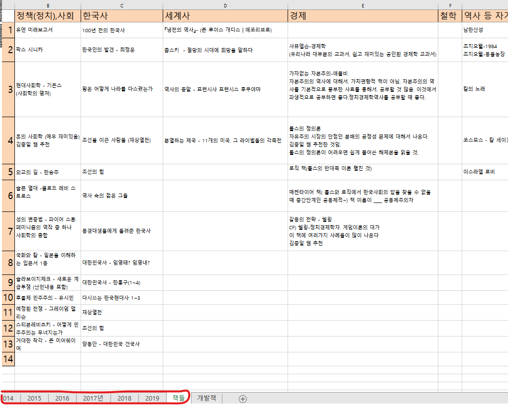
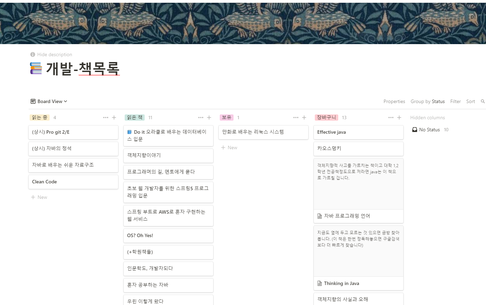

> 많은 개발자들이 매년 회고를 남기는 것을 보고 나 역시 매년 스스로의 흔적을 남기고 발전하고자 이 글을 쓴다.
> 지나가는 나이 많비전공자들이 보고 도움이 1이라도 되었으면 하는 마음에서.

# 1. 개발 입문

누구나 그렇듯이, 우여곡절이 많았다. `5수`를 해서 11학번으로 대학교에 입학했고, 본격적으로 졸업하기 전부터 취업 준비해서 `만5년` 의 오랜 시간 끝에 자리를 잡게 되었다. 31.9살에 개발 공부를 처음 시작하여, 32후반이었던 작년 2020년 10월에 스타트업에서 개발자 커리어를 시작하게 되었다.

## 왜 5수?

- 재미있는 것을 찾았기 때문

학창시절 내내 게임, 운동 말고는 관심이 별로 없다가 고3 때 다들 `in 서울` 대학을 목표로 하는 것을 보고 따라 진지하게 공부를 해보니 너무(~~갑자기..~~) 재미가 있었던 것. 하지만 그때는 이미 수능 한달 전. 역대급으로 어려웠던 수능 수학 시간에 나는 1시간이 넘게 시간이 남아서 여유로웠다. 5번까지만 풀고 나머지는 다 찍었기 때문. 다른 과목들도 마찬가지였고 남는 시간은 생산적으로 보내고 싶어 재수계획을 세웠고, 수능을 마치고는 빨리 달려가 친구들이랑 [도타](https://namu.wiki/w/%EB%94%94%ED%8E%9C%EC%8A%A4%20%EC%98%A4%EB%B8%8C%20%EB%94%94%20%EC%97%90%EC%9D%B8%EC%85%98%ED%8A%B8)를 하러 pc방에 갔다.. ???

- 목표는 최고대학, 현실은 지하 10층. 올라오는 데 걸린 시간 `5수`

  (사진 - 이경규 무식한놈이 신념을 가지면 무섭다)

  왜 5수를 했냐는 질문은 살아오면서 수백번은 들은 것 같다.(~~사실 왜보다는 어떻게~~). 재수를 시작했을 때는 우리나라 최고대학을 목표로 삼았다. 하지만 나는 현실도 모르는 [무식한 놈](https://namu.wiki/w/%EC%9E%98%20%EB%AA%A8%EB%A5%B4%EA%B3%A0%20%EB%AC%B4%EC%8B%9D%ED%95%9C%20%EC%82%AC%EB%9E%8C%EC%9D%B4%20%EC%8B%A0%EB%85%90%EC%9D%84%20%EA%B0%80%EC%A7%80%EB%A9%B4%20%EB%AC%B4%EC%84%AD%EC%8A%B5%EB%8B%88%EB%8B%A4)이었기 때문에 매운 맛을 많이 봤다. 중학교 1학년 수학부터 시작해 학을 뗄 정도로 공부를 했지만 `의지`만으로 1년만에 모든 것이 가능하다고 생각했던 멍청했던 나는 기초가 워낙 없어서 매년 실패했다. 재수학원비가 비싸 일을 하며 주경야독으로 공부를 했고, 총 5번의 수능을 본 후 마침내 과분한 대학교에 입학하게 되었다. 전공은 사범대학 체육교육과였다. 운동을 좋아했기 때문. 힘든 기간이었지만 공부가 너무 재미있어서 버틸 수 있었다.(~~그런데 더 재미있는 것들은 널렸다~~)

## 그런데 취업은 왜 또 5수? 갑자기 개발?

학부생 때, 주변의 권유로 꽤 큰 시험을 치르기 위해 군 복학 이후로 각종 자격증, 영어 점수, 대외활동 등을 몇 년간 준비하고 공부했다. 하지만 나 자신과 미래에 대한 성찰을 깊게 하지 않은 상태에서 단순하게 번듯한 직업만을 바라봤던 나는 결국 한계에 부딪혔다. 그래서 의욕이 점점 없어져서 시험에도 여러번 떨어지게 되었다. 이때부터 몇 년간 `지옥의 시간`을 보냈다. `매몰비용`을 생각해 기존의 시험을 완전하게 포기하지도 않은 상태에서 관심도 없는 직무의 기업 등에 지원하는 것을 병행했다(생계를 위해). 그러다가 대학원연구실, 컨설팅 RA, 인턴 등을 `어둠 속에서 배회` 하던 중 우연히 개발 분야를 알게 되었다. 스타트업에서 인턴하는 중 개발자 어깨너머에서 아무생각 없이 구경하다가 코드를 살짝 수정하니 웹에 보여지는 페이지가 확 달라지는 것을 보고 엄청 신기했던 적이 있었다. `저건 뭐지?`. 그래서 퇴근하고 [강의](https://www.youtube.com/watch?v=jSJM9iOiQ1g&list=PLuHgQVnccGMDUzDDCKW-pCZQY-MMCX5yB&index=3)를 보며 html에서 내가 쓴 글씨가 `웹`에 나오는 것을 보고 엄청 희열을 느꼈고, 마법처럼 빨려 들어갔다. `이거다...!`

무엇보다, 내가 해온 공부들이랑 다르게 원인과 결과, 그리고 답이 너무나 깔끔하고 명확하다는 것에서 굉장한 큰 매력을 느꼈었기 때문에 나의 업으로 결정했다.

# 2. 국비지원학원

## 공부 방법

- 처음에는 youtube나 인터넷 강의로 준비를 하려고 했다. 하지만 컴퓨터에 대한 지식에 전무한 나는 단순히 혼자서 어둠 같은 바닷속에서 준비하는 것이 불안하고 무서웠고 어떻게든 체계화된 시스템이 필요하다고 생각을 했다.
### 왜 `국비지원`을 선택했는가
- 금전적인 여유가 전혀 없었다. 개인적으로 안정화된 일자리 없이 몇 년간 이것저것 준비만 했기에 후기 좋은 사설 학원(짧은 몇개월에 몇백만원...)은 도저히 생각도 할 수도 없었다. 하지만 주변에서 국비지원교육을 받은 지인들이 몇 명 있어서 정보를 구했다. 하지만 하나같이 추천하지 않았고...그럼에도 나는 금전적인 이유로 다른 선택지가 없었고 학원의 부족함은 나의 노력으로 채우겠다는 다짐을 했다.

### 국비지원의 아쉬운 점
- `학생들의 실력 발전이 1순위가 아니다`. 고용노동부에서 요구(그리고 보고한)하는 커리큘럼 이수가 우선인 선생님은 학생들의 수준과 배려를 생각할 여유가 없으셨던 것 같다. 학생들이 제대로 배우지 못하더라도 어떻게든 꾸역꾸역 `아무데나` 취업만 하더라도 `취업률`은 올라가고, 학생들의 성취보다 고용노동부에서 점검 나와 치르는 시험점수가 더 중요한 포지션에 있으시므로 어쩔 수 없는 면이 있었던 것 같다. 그럼에도 국가에서 무료로 지원해주는 교육이므로 눈물을 머금고(~~감사한 마음으로~~) 이수했다.

- `실습을 많이 하는 선생님` 을 선택해야 한다.(~~그런데 잘 찾기가 힘들다~~) 나는 학원에서 나이도 제일 많아 열심히 하고자 반장을 도맡아 수업 분위기를 잘 이끌고자 노력했다. 하지만 첫 한 달 가량의 수업 이후 중간에 선생님이 바뀌었는데, 사실 잘 맞지 않았다. 그 선생님을 비난하는 것은 아니지만(~~포지션상 어쩔 수 없는 부분도 있기에..~~) 폭주기관차처럼 수업만 나가시는 바람에 전공자들도 수업을 따라가기 쉽지 않았다. 하지만 6~7개월간의 기간 중 지식들이 가장 기억에 남았던 시간은 첫 한달동안 매일 하루에 1시간씩 실습이자 미니시험을 치뤘던 기억이다. 개발은 `무조건 직접 만들면서 삽질을 해야 빨리 배운다.` 그래서 지식을 잘 전달하는 것도 중요하지만 무엇보다 직접 실습을 많이 하게 하고 학생들의 실력 발전에 관심이 많으신 선생님을 선택해야 한다.(~~후기들을 잘 읽어봐야 하지만 사실 `복불복`인 경우가 많다..ㅠㅠ~~). 

- `여유가 된다면 국비지원을 선택할 이유가 전혀 없다.`. 왜냐하면 돈보다 시간이 훨씬 더 중요하기 때문이다. 어설픈 학원에서 어설픈 포트폴리오와 실력으로는 괜찮은 회사에 취업을 할 수가 없고 그러면 심지어 학원 이수 이후에도 새로 포트폴리오를 쌓고 공부하는데에 있어서 또 몇 개월간 소모를 해야 한다. 우리 반에서는 심지어 절반 이상이나 학원 수료 후 몇 개월간 취업을 못했다. 그 `잃어버린` 시간을 생각한다면 단순히 공짜라고 해서 국비지원학원이 좋은 대안이라고는 쉽게 말하지 못하겠다. 돈이 더 들고 고생하더라도 더 좋은 대안(잘 가르치는 사설 학원, 스터디 등)을 선택해서 좋은 회사에 빨리 취업하는 것이 훠얼신 이득이라 생각한다.(경력, 월급, 실력 등의 측면에서). 빨리 취업해서 현업에서 배우는 것이 혼자 공부하는 것보다 몇배나 더 효율적이기 때문이다.

- 참고로 국비지원 교육에 대해서는 많은 참고자료(?)들이 있지만 [인프런 강의 - 홍보 아님](https://www.inflearn.com/course/%EA%B0%9C%EB%B0%9C%EC%9E%90-%EC%B7%A8%EC%97%85-%ED%86%B5%ED%95%A9%ED%8E%B8/dashboard) 에서 말한 부분이 너무나 공감되어 링크를 남긴다. 

# 3. 개발서 목록

- 원래 책을 좋아하는 편이다. 위의 사진은 군 전역 후부터 계속 읽어왔던 책 목록과 리스트이다. 하지만 이제는 개발 분야로 오고 나서부터는 거의 다 기술서로 바뀌었다. 아직 실력이 너무나도 부족하고 공부할 것들이 많아서 1~2년간은 기술서 위주로만 주로 읽을 생각이다. (~~내 같은 쪼렙 개발자가 다른 책들을 읽는 건 사치라고 생각~~)
- 아래 사진은 요즘 관리하고 있는 책 목록이다. 원래는 노션페이지로 관리했으나 요즘에는 [블로그 책, 강의 리스트](https://highjune.netlify.app/etc/books_lectures/) 에 주로 최신화하며 정리하고 있다.

## 책으로 공부하는 이유
- 학원, 인터넷 등의 강의들도 좋지만 책으로 공부하는 가장 좋은 이유는 `내가 뭘 모르고 있는지 알 수 있다는 것` 이다. 나같은 비전공자들은 뭐를 도대체 왜 공부해야되는지 조차 모를 것이다. 하지만 책의 목차, 그리고 서문에 해당 기술의 등장배경 등에 대해서 소상하게 알려준다. 사실 비전공자 개발자들은 자잘한 기술에 대한 설명들보다 이러한 `네비게이션` 같은 설명이 훨씬 중요하다. 그래야 방향이 잡히고 왜 이 공부를 해야하는지 감이 어느정도(~~그럼에도 초반에는 전혀 잡히지 않는다~~) 잡히기 때문이다. 

# 4. 깃 허브

- usb 갖고 다니다가 버리게 된 멍청한 행동
  - 버리게 되었다.
- 깃허브로 java공부한 것들 관리

  - 그러다가 오류가 났는데 해결하지 못해서 깃을 날렸다가 모든 히스토리. 예쁘게 ㅅ삭처럼 가꾸던 잔디에 불을 다 질러버린 것. 휑해진 잔디를 보며 분노(~~방화범은 집 주인~~)의 git공부를 시작하였다. git-flow공부

- 롤모델

  - 정수
    - 친분
    - 창의적
    - 강의 추천
  - 이종립

- 블로그

  - 정리벽
  - gatsby + netlify

- 입력보다 출력이 중요하다.
- 노션 글 취업에 도움 됨
- 책 좋아함. 엑셀 목록 보여주기
